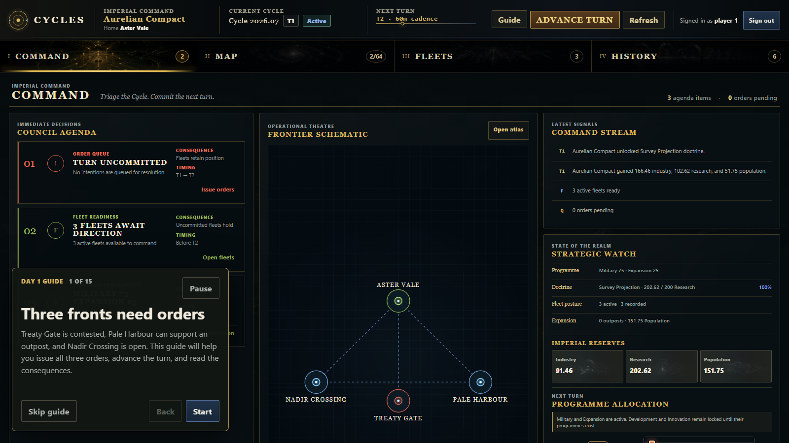
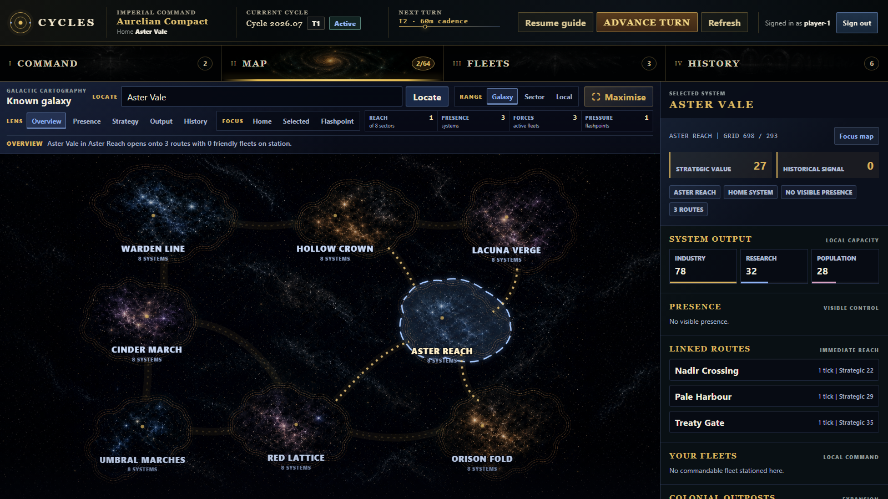

# Gameplay Guide

This is the player-facing guide for the pre-alpha development build as of 14 July 2026. It is intended to grow into the Alpha Tester's Guide when the game is ready for alpha.

Cycles is a tick-based strategy game. You submit intentions, then the server resolves them during the next tick. Your current aim is to project influence, gather resources, build ships, establish outposts, and create a history worth recording in the Chronicle.

The development build does not have a finished victory screen or a complete set of game systems. Test the decisions that exist, note where the result surprises you, and report anything that makes the next choice unclear.

## What you need

For the curated local opening:

- follow the [run instructions](../README.md#run-locally);
- open `/app.html` on the local site;
- use the prefilled `player-1` username;
- start from tick 0 of a freshly seeded state.

Reseed the local file if the opening has already been played:

```powershell
dotnet run --project src/Cycles.Cli -- seed data/cycles-state.json
```

Stop the API before replacing a state file that it is using, then start it again. The normal seed command creates the fixed `development-cold-start-v1` opening. Explicit dimensions and seed values create a generic galaxy instead.

For an organised hosted test, use the access code and username supplied by the organiser. The trusted playground uses the same manual **Advance turn** flow as local Development; there is no scheduled shared turn in that environment. The development login creates a new empire when it does not recognise a name, so a spelling change can put you in a different empire. Use it only in a trusted environment.

## Curated Day One

The Day One guide opens automatically for `player-1` when the curated Cycle is at tick 0 with no submitted orders. It is a click-along walkthrough, not a slideshow: required steps unlock only after the real server action succeeds.



*The Command view opens with the resumable Day One guide and the next-turn information kept together.*

Your Aurelian command begins with three live problems:

- **Nadir Crossing is open.** Move the 30-ship **Aurelian Home Guard** there from Aster Vale.
- **Pale Harbour is ready for an outpost.** Commit the 12-ship **Pale Harbour Survey** and 100 Population.
- **Treaty Gate is contested.** Send the 18-ship **Treaty Gate Vanguard** against the local Khepri force.

The guide takes you through this sequence:

1. Read the resource cards and what each stockpile pays for.
2. Drag any priority slider. The other three rebalance automatically to keep the total at 100; select **Save priorities** to commit the new allocation.
3. Select highlighted Treaty Gate on the map and inspect the Vanguard.
4. Read the visibility note: routes are always known, while exact remote facts require an active fleet in the system.
5. In **Fleets**, select **Aurelian Home Guard**. The guide opens **Move**; choose **Nadir Crossing**, then select **Queue move**.
6. Select **Pale Harbour Survey**. The guide opens **Colonise**; select **Queue outpost**.
7. Select **Treaty Gate Vanguard**. The guide opens **Attack**; choose the **Khepri Mandate**, then select **Queue attack**.
8. Check that the order queue contains the three commitments.
9. Select **Advance turn**.
10. Read the factual results in **Events**, then open the selective **Chronicle** account of Treaty Gate.
11. Read how the current tick fits into the operator-driven Cycle end, final ranking, and successor boundary.

All three orders use the normal order API and resolve through the normal authoritative tick engine. The opening positions are curated; movement, resource generation, combat losses, admiral history, events, and Chronicle selection are simulation results. The battle is deliberately staged at a sufficiently important system to create an immediate Chronicle entry without scripting its outcome.

The guide remembers progress for each player and seeded Cycle instance in that browser. Reseeding creates a fresh tutorial. **Pause** or Escape closes it without losing the current step. **Skip guide** dismisses it. **Guide**, **Resume guide**, or **Restart guide** in the dashboard toolbar opens it again.

**Advance turn** is a temporary Development capability for every authenticated player. It resolves the whole galaxy, not only your empire. It does not grant admin visibility or control of another empire, and ordinary players do not receive the capability in Production.

If the curated briefing is unavailable, **Guide** presents a shorter generic version of the same loop: inspect, prioritise, move, advance, and review.

## Read the dashboard

The dashboard keeps four views available at all times. Browser back and forward also move between them.

- **Command** shows the information needed before the next tick: resources, priorities, pending orders, and a short status pulse.
- **Galaxy** gives the map the full workspace and keeps the selected system's details beside it.
- **Fleets** uses the roster selection as the context for Move, Attack, and Colonise. **Fleet command** keeps those actions close to the selected fleet's detail; **Resolved orders** provides scoped outcome filters and loads 20 matches at a time.
- **History** separates the narrative **Chronicle** from the factual **Events** record. Both tabs support search, filtering, and sorting.

The guide moves to the relevant view as each step begins. You can also use Alt+1 through Alt+4 to switch views.

In **Galaxy**, the map shows every system and route. Select a system to inspect its resource output, strategic value, historical significance, visible influence, and colonial outposts.



*The Galaxy view gives the map most of the workspace and keeps the selected system's details beside it.*

The map legend marks:

- **Home**: your empire's founding system;
- **Historic**: a system with recorded historical significance;
- **Presence**: your effective influence at a system;
- **Contested**: more than one empire has visible presence there.

The **Held** count means systems where your empire has positive presence. It does not mean permanent ownership.

You can see the full galaxy structure and routes, but exact presence, local fleets, events, last-tick facts, and Chronicle entries depend on active-fleet visibility. A system with no displayed enemy presence may contain facts that your empire cannot see.

The four priority weights must total 100. Change the values, check the displayed total, then select **Save priorities**. The new allocation affects the next tick.

| Priority | Effect in the current build |
| --- | --- |
| Industry | Stored as part of your allocation, but has no separate spending effect yet. Industry income comes from influence. |
| Research | Stored as part of your allocation, but has no separate spending effect yet. Research income comes from influence. |
| Military | Spends that percentage of your industry stockpile on ships during each tick. Each ship costs 25 industry and takes three ticks to complete. |
| Expansion | Adds the same percentage as a bonus to your effective presence. More presence increases your resource share and can help you qualify to colonise. |

Research still matters even though its priority weight has no direct effect. At 200 research, your empire unlocks **Survey Projection**, which adds a further 10% effective-presence bonus.

For the clearest development experiment, change the balance between Military and Expansion. Putting weight into Industry or Research reduces those two active effects, but does not yet create another direct benefit.

The order appears as **Pending** in the **Command** view's order queue and says which tick can process it. Resolved orders move to **Fleets** > **Resolved orders**, where they can be scoped to the selected fleet or all fleets and filtered by outcome. A fleet must target an adjacent linked system. Some routes complete during the processing tick; longer routes leave the fleet in transit until its arrival tick.

Select a fleet in **Fleets** to see its current system, destination, admiral, adjacent routes, local fleets, and recent orders.

After **Advance turn**, the dashboard refreshes automatically. Use **Refresh** if another host advanced the Cycle or if you want to reload the current state, then check:

- the tick number beside the Cycle name;
- your fleet's location or arrival tick;
- the order status and any rejection reason;
- last-tick resource gains and spending;
- new events;
- any Chronicle entry created by a major battle.

You have now completed the main loop: inspect, decide, queue, resolve, and review.

## The gameplay loop

Repeat these actions before each tick:

1. **Survey the map.** Look for valuable systems, linked routes, visible rivals, and places where your influence leads.
2. **Check your economy.** Compare stockpiles with the last tick's gains and spending.
3. **Set priorities.** Decide how much industry to turn into future ships and how much expansion influence to project.
4. **Issue fleet orders.** Move towards a target, attack a local rival, or establish an outpost.
5. **Review pending orders.** Cancel mistakes before their execution tick.
6. **Read the result.** Events explain resource gains, movement, construction, combat, rejected orders, and colonisation.

The server rechecks each order when it processes the tick. An order that was valid when queued can fail if the fleet moves, the target disappears, a rival changes local influence, or another action spends the required resources.

Queue one order per fleet per tick while learning the game. The current build accepts multiple pending orders for one fleet and processes them in submission order, so a later order may become invalid after the first one changes the fleet.

## Influence and resources

Active ships create presence in their current system. Each system divides its Industry, Research, and Population output between the empires present, in proportion to their effective presence.

Your home system provides a minimum presence of 10, which gives a weakened founding empire some recovery pressure. Expansion priority and the Survey Projection doctrine multiply presence. A supported colonial outpost adds five presence.

Resources are stockpiles:

- **Industry** pays for ship construction through Military priority spending.
- **Research** accumulates towards doctrine unlocks. Survey Projection is the sole unlock in this build.
- **Population** pays for colonial outposts.

The dashboard shows each total alongside the amount generated and spent during the last tick.

## Fleet orders

### Move

A move order sends an active fleet along one linked route. Queue another move after the fleet arrives if the destination is more than one route away.

Movement changes what you can see and which systems contribute resources to your empire. An outpost stops projecting its five presence when your empire has no active fleet in its system.

### Attack

An attack order fights hostile active fleets in the attacker's current system when the tick processes. Select a named target when the dashboard offers one, or leave the target as **Nearest hostile** to attack a local hostile empire chosen by the server.

Ship numbers affect the chance of victory, but both sides take losses. A destroyed fleet leaves active play. Combat can kill its assigned admiral, while surviving commanders gain or lose reputation from the result.

An attack through an Alliance or Non-Aggression Pact cancels that relationship and records the breach. Players cannot create or manage diplomatic relationships in the dashboard yet.

### Colonise

An outpost costs 100 Population and resolves on the next tick. To queue one, your fleet must:

- be active and outside its home system;
- belong to your empire;
- have more effective presence than each rival in that system;
- have no existing or pending outpost for your empire at that system.

Your empire must still meet those conditions when the tick processes. The outpost adds five local presence while your empire keeps an active fleet there. It does not create permanent ownership, prevent rival entry, or survive as an independent source of influence when your fleet leaves.

### Cancel

Select **Cancel** beside a pending order to withdraw it. You cannot cancel an order after its execution tick begins or after the server processes, rejects, or cancels it.

The Core simulation supports Hold orders, but the current dashboard has no Hold control. A fleet with no order stays where it is.

## Events, admirals, and the Chronicle

**History** > **Events** shows the latest visible facts. Search the descriptions, filter by severity, or change the ordering to understand what a tick changed.

The selected-fleet detail in **Fleets** names an assigned admiral and shows reputation and status. Battle results create an admiral history. A destroyed commanded fleet can kill its admiral.

**History** > **Chronicle** records battles that cross the current historical-importance threshold. Each entry labels its source tick and importance, then presents the factual summary before the longer report. Battle size, strategic value, existing history, an underdog result, and notable admirals can raise the score. Most events do not become Chronicle entries.

Chronicle reports use deterministic templates in this build. They are not generated by an AI service.

## What the development build does not include

Set expectations against the current build:

- no player-facing diplomacy controls or alliance effects;
- no technology tree beyond Survey Projection;
- no fleet splitting, fleet creation, or admiral management;
- no outpost capture, destruction, infrastructure, or migration;
- no production authentication or open multiplayer security boundary;
- no finished Cycle-end screen or automatic declaration of a winner;
- no balanced combat guarantee;
- no hidden-map exploration, sensors, or partial intelligence model.

An administrator ends a Cycle and creates its successor outside the player dashboard. Final ranking uses map-control percentage, but the development build focuses on testing the choices that create influence rather than presenting a finished victory flow.

## Troubleshooting

### The server rejected my order

Read the rejection reason in **Order Queue**. Common causes include:

- combat destroyed the fleet, or the fleet entered transit;
- a move target was no longer adjacent;
- no hostile active fleet remained in the attack system;
- your colonising fleet left the system;
- your empire lost the strict influence lead;
- your Population fell below 100 before colonisation resolved.

### I cannot select Colonise for a fleet

Select an active fleet in the roster first. **Colonise** remains unavailable while that fleet is at its home system; move it to another system and wait for it to arrive.

### The map shows a system but no local details

Your empire lacks an active fleet there. The current build reveals the map structure while hiding exact remote presence and fleet facts.

### Refresh did not advance the game

Refresh reloads data without processing a tick. In Development, every authenticated player sees **Advance turn**. In Production, ordinary players must wait for the scheduled tick or contact the operator; only a trusted admin receives the manual capability.

### My priorities will not save

Check that all four values are zero or greater and total 100.

### I logged into the wrong empire

Enter the assigned username and select **Login** again. Report any accidental empire that the incorrect username created so the test organiser can clean it up.

## Reporting useful feedback

For a bug or confusing result, record:

- your username and empire;
- the Cycle tick number;
- the fleet and system involved;
- the order or priority change you submitted;
- what you expected;
- what happened, including the order status or rejection reason;
- a screenshot when the display is part of the problem.

Separate rule feedback from software defects. “Expansion feels too strong” is balance feedback. “The displayed total was 100 but Save priorities failed” is a defect. Both are useful when the report includes the tick and game state that produced the result.

Do not include passwords, connection strings, access tokens, or private server details in a public issue.

## What you have learned

You can now log in, read the visible galaxy, tune the two active strategic levers, move a fleet, attack a local rival, establish an outpost, and trace each result through orders and events. Future versions of this guide can add diplomacy, richer doctrines, Cycle-end play, and guided strategy scenarios when those systems reach the dashboard.

For a detailed account of implemented and planned behaviour, see [Project State](project-state.md).
