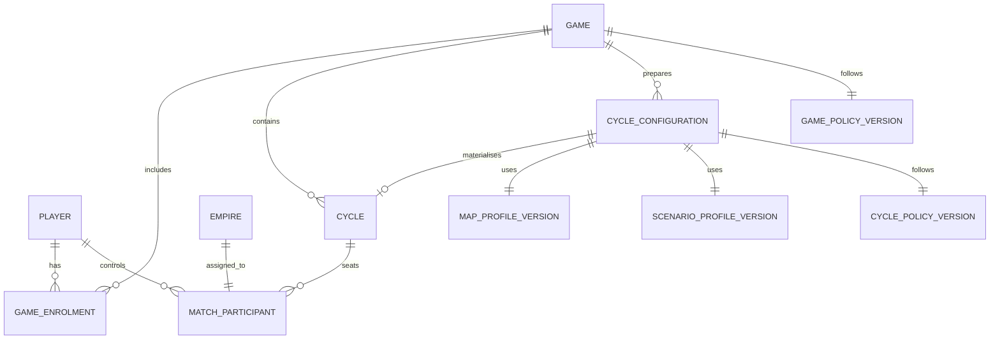
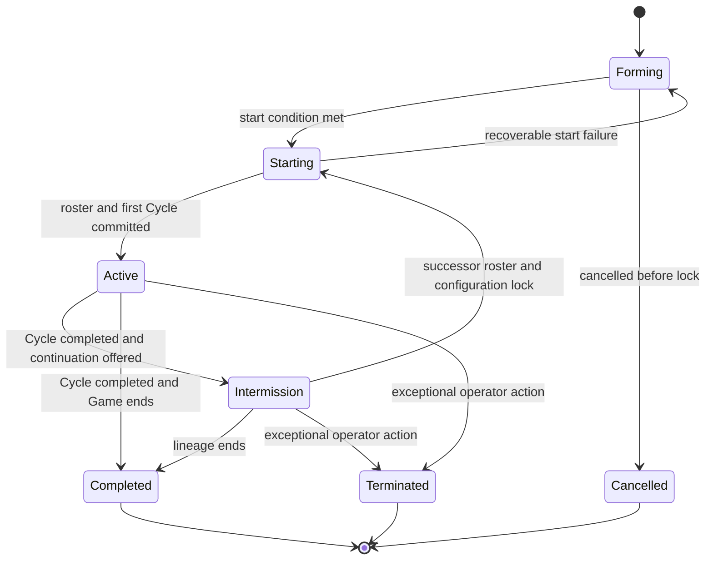
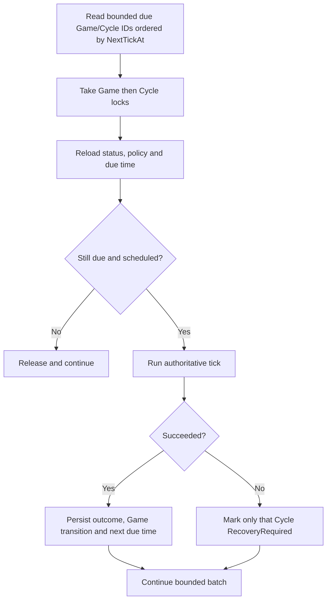

# Multi-game and tutorial platform plan

Status: approved on 19 July 2026; implementation has not started

Last reviewed: 19 July 2026

## 1. Purpose

This plan turns two accepted directions into one coherent product and technical programme:

- a persistent player can take part in more than one game;
- compact training maps and journeys are distinct from larger standard games.

It covers the player experience, information architecture, tutorial content, authored map profiles, domain model, SQL persistence, API boundaries, Worker scheduling, concurrency, security, migration, rollout, observability, and verification.

This is not an implementation issue and it does not mark any of the proposed systems as delivered. Once the load-bearing premises are agreed, the reviewed plan should be split into bounded GitHub issues with explicit dependencies and acceptance criteria.

## 2. Existing decisions and constraints

The following direction is already accepted in the project documentation:

- a future tutorial is a standalone compact game with one human seat;
- tutorial play uses the same authoritative mechanics as standard play;
- standard games use separate, larger map profiles;
- a persistent `Player` may enrol in several game instances;
- manual organisation and scheduled population should converge on one membership model;
- the current Day One guide and `development-match-v2` remain in place until a true replacement exists.

The current runtime still assumes one globally active `Cycle` in several important places:

- authentication and account admission;
- dashboard bootstrap and all gameplay routes;
- order mutation;
- due-tick discovery;
- successor-Cycle generation;
- state-transfer validation;
- the browser's single selected Cycle and empire state.

Useful foundations already exist:

- `Player` is persistent and independent of a Cycle;
- `MatchParticipant` already binds a player to an empire inside one Cycle;
- the same player can be a participant in different Cycles at the SQL level;
- the tick engine and the focused SQL tick path already accept an explicit Cycle identifier;
- SQL tick locking is already per Cycle;
- existing integration tests prove that an explicit tick can change one Cycle without loading or changing an unrelated active Cycle;
- map generation, curated scenarios, opening objectives, orders, outcomes, events and Chronicle entries already have deterministic seams worth preserving.

## 3. Product thesis

Cycles should become a two-level application:

1. an account-level home where a player finds, joins, resumes and reviews games;
2. a selected-game shell containing the existing Command, Map, Fleets and History workspaces.

Training is not a simulation fork. A training attempt is a real, private game whose differences are limited to:

- a compact immutable map and starting-scenario profile;
- one human seat;
- a self-paced resolution policy;
- an authoritative, resumable journey layered over normal game facts;
- safe replay and fresh-attempt semantics.

The tutorial should teach players how Cycles actually behaves, including uncertainty, rejected orders, multi-tick travel and reading outcomes. It must not manufacture victories, silently correct commands or substitute scripted results for the normal resolver.

The first product proof is deliberately narrower than the whole platform: one account can safely see the existing standard Game and one private Training Game, switch between them, resolve a real training command, leave and resume. That walking skeleton must reach fresh players before public discovery, generic matchmaking or multiple concurrent standard Games are built out.

Training cannot graduate into an empty room. Every training pilot must run alongside either an operator-curated standard cohort with a stated start condition or an honest `Register interest` path for the next cohort. Public lobby liquidity is not assumed.

## 4. Confirmed load-bearing premise

### A Game contains one or more Cycles



Under this model:

- `Game` is the player-visible container: lobby, membership, rules, map provenance and historical lineage;
- `Cycle` is an authoritative simulation epoch inside that game;
- a Game has at most one operational Cycle at a time;
- many Games may have operational Cycles at the same time;
- `GameEnrolment` records the durable player-to-game relationship;
- `MatchParticipant` remains the Cycle-specific player-to-empire authority;
- successor-Cycle participation requires explicit reconfirmation during Intermission; a future private-Game carry-forward policy would be a separate decision.

This fits the existing successor-Cycle concept and avoids inventing a second grouping object later merely to reconnect related Cycles.

The rejected alternative is `Game == Cycle`. It is superficially simpler but makes each successor a new game, splits one historical lineage across several player-visible records, and is likely to require a `Series`, `Campaign` or equivalent aggregate later.

This premise was confirmed by the product owner on 19 July 2026.

## 5. Terminology and ownership

| Term | Meaning | Owns or controls |
|---|---|---|
| `Player` | Persistent account identity | external identities, account status, global role and login audit |
| `Game` | Player-visible playable container | lifecycle, profiles, policy, capacity, provenance and Cycle lineage |
| `GameEnrolment` | Player's durable relationship to a Game | enrolment status, seat claim, origin and lifecycle audit |
| `QueueEntry` | A request to be matched before a Game or seat is secured | queue status, preferences, offer and expiry |
| `CycleConfiguration` | Immutable plan for the next Cycle | profile versions, seed, roster bounds, schedule and materialisation status |
| `Cycle` | One authoritative simulation epoch | tick state, schedule, recovery and predecessor relationship |
| `MatchParticipant` | Player's authority inside one Cycle | assigned empire and participant status |
| `Empire` | Simulation actor within one Cycle | resources, fleets, influence and game outcomes |
| `MapProfile` | Immutable topology definition | sectors, systems, routes, coordinates, capacity bounds and atlas metadata |
| `ScenarioProfile` | Immutable starting-state definition | starting empires, fleets, neutrals, objectives and stockpiles |
| `GamePolicy` | Immutable lineage and enrolment policy | start mode, continuation, withdrawal and optional AI-fill rules |
| `CyclePolicy` | Immutable execution policy | cadence, resolution authority and duration |
| `TutorialDefinition` | Versioned learning journey | lessons, copy, hints and evidence rules; never simulation outcomes |
| `TutorialRun` | One player's progress through one training attempt | presentation acknowledgements and derived milestone state |

Important separations:

- authentication creates or resolves a `Player`; it does not create an empire or enrol the player in a game;
- matchmaking may create an enrolment, but it must not create a parallel membership model;
- a map profile defines topology, not tutorial prose, starting armies or scheduling;
- a scenario profile defines starting state, not resolver exceptions;
- actual map, scenario, execution-policy and seed provenance belongs to each Cycle through its locked `CycleConfiguration`, not only to the containing Game;
- journey progress observes authoritative facts; it does not author them.

## 6. Information architecture

The account shell sits above the existing game shell. It is not a fifth gameplay tab.

```text
Authenticated Cycles
├── Games home
│   ├── Strongest next action
│   ├── Training
│   ├── In-progress games
│   ├── Waiting / enrolled games
│   └── Recently completed games
├── Find a game
├── Game lobby / waiting room
└── Selected game
    ├── Command
    ├── Map
    ├── Fleets
    └── History
```

Initial hash routes can preserve the current static application:

```text
#/games
#/find-games
#/games/{gameId}/lobby
#/games/{gameId}/command
#/games/{gameId}/galaxy
#/games/{gameId}/fleets
#/games/{gameId}/history
```

The URL is the authoritative game selector. Local storage may remember conveniences such as the last view for a particular player and game, but it must never select the security context. Explicit URLs also make two tabs showing different games safe and unsurprising.

### 6.1 Games home

Use the existing archival ledger and command-table visual language rather than a generic card mosaic.

The first viewport contains a compact `Needs attention` ledger, not a hero card. It shows at most three actionable Games and never hides how many additional items need attention:

1. active Games with the nearest command deadlines;
2. Games that have just started;
3. an incomplete Training Game;
4. for an empty account, `Start Training`.

Cross-game urgency is deterministic. The service returns both rank and reason so the client does not recreate scheduling logic. On narrow screens the first row remains visible and a link such as `2 more need attention` reaches the rest; no deadline is represented only by colour or silently hidden behind a single recommendation.

Each game row should show only facts that are authoritative:

- game name;
- Training or Standard kind;
- map profile, topology size and cadence;
- membership or seat state;
- empire when assigned;
- current Cycle and tick when one exists;
- next command deadline or start condition;
- one contextual action: `Continue`, `Enter lobby`, `Observe` or `Review`.

Use “Commands open until…” rather than “Your turn”; Cycles has simultaneous command windows.

An account with no memberships should explain the state and offer both useful exits: `Start Training` and, only when curated supply exists, `Find a standard game`. Otherwise the second action is the honest `Register interest` path.

### 6.2 Find a game

Use a filterable ledger. A listing may include:

- map profile and size;
- human capacity and confirmed enrolment count;
- cadence;
- scheduled start or explicit start condition;
- optional AI-fill policy;
- withdrawal and no-show policy.

Do not invent queue position, expected start time or seat certainty unless the service can guarantee it.

The final-seat race is an expected state, not a generic error. If another player secures the last place first, refresh the listing and say so directly.

### 6.3 Lobby / waiting room

The lobby is a pre-game page, not a gameplay workspace. Its first viewport answers:

1. when or under what condition will this game start?
2. is this player's seat secured, queued, expired or locked?
3. which profile and rules did the player join?

Recommended regions:

- authoritative status and start condition;
- the player's enrolment and permitted action;
- aggregate human and AI seat ledger;
- map, cadence, expected duration and start policy;
- recent lifecycle events.

Avoid a `Ready` action unless a later decision explicitly adopts attendance confirmation. `Enrolled` is clearer and does not collide with the deliberately rejected notion of per-turn player readiness.

When the game becomes active, announce the transition in a polite live region and reveal `Enter game`; do not steal focus or navigate while the player is interacting.

#### Between Cycles

Intermission reuses the lobby route and visual structure with different language; it is not an empty selected-game dashboard.

- Games Home group: `Between Cycles`.
- Game selector group: `Between Cycles`, between Active and Waiting.
- Primary status: `Cycle IV has ended` plus the final standing and date.
- Primary action under the recommended reconfirmation policy: `Confirm for the next Cycle`.
- Secondary actions: `Review completed Cycle`, `Leave this Game` and profile/rule details for the proposed successor.
- If no successor is configured: `The organiser has not opened the next Cycle yet`; no false date or queue position.
- If reconfirmation expires: show the recorded expiry and whether the seat reopened.
- Automatic carry-forward is outside the first policy. A future private-Game variant must define its withdrawal deadline and player-facing copy separately.

The route is `#/games/{gameId}/lobby` with lifecycle state from the service; query-string UI modes must not become a second source of truth.

### 6.4 Selected-game shell

Retain the four existing workspaces. Add:

- `All games` navigation;
- the selected game name and kind near the empire identity;
- a labelled native game selector grouped by Active, Between Cycles, Waiting and Completed; non-active selections open their lobby/intermission or read-only summary rather than an empty gameplay workspace;
- game-specific page titles.

Switching games must:

- warn only when genuine unsaved client state exists, such as edited but unsaved priorities;
- never warn for pending orders that are already durable;
- cancel or invalidate in-flight requests;
- clear the previous game's data before repainting;
- namespace selection preferences by player and game;
- move focus to the new page heading.

A missing, stale or foreign game identifier should render the same safe `Game unavailable` state and must not reveal whether the identifier exists.

### 6.5 Defeated and completed games

The server should return typed permissions instead of asking the client to infer authority from status text.

- A defeated participant in an active game gets `Observe`, a persistent defeat banner and read-only views.
- A completed game gets `Review history`; the same workspaces render read-only.
- Command becomes a final situation and standing summary for completed games.
- A cancelled pre-start game remains a lobby record with its cancellation explanation; it does not pretend to have a playable archive.

## 7. Required UI states

| Surface | States that need intentional designs |
|---|---|
| App boot | checking session; development selector or OIDC; authenticated account with no games; account loaded; service unavailable |
| Games home | loading; empty; active; waiting; completed; partial section failure; stale cached summary |
| Discovery | joinable; full; joining; queued; enrolled; locked; withdrawn; expired; cancelled; empty catalogue |
| Lobby | waiting for seats; scheduled; under-filled; AI fill planned; delayed; starting; active; cancelled; access removed |
| Game load | initial load; background refresh; stale read-only snapshot; unavailable; recovery required |
| Membership | commandable; defeated read-only; completed read-only; withdrawn; removed |
| Tutorial | not started; provisioning; resumable; lesson complete; journey complete; resetting; reset blocked; reset failed |

For a partial Games-home failure, keep successful sections usable and put retry beside the failed region. Inside one selected game, retain the coherent all-at-once bootstrap; if refresh fails, keep the last snapshot visibly stale and disable mutations until freshness returns.

### 7.1 Visible state contract

| Feature | Loading | Empty | Error | Success | Partial or stale |
|---|---|---|---|---|---|
| Games home | ledger-shaped skeleton with heading retained | plain explanation plus `Start Training` and a supply-aware second action | account-level error with correlation ID and retry | Needs attention followed by grouped Games | successful groups remain; failed group owns its retry |
| Find a Game | table headers and bounded row skeletons | `No curated Games are recruiting` plus register-interest action | catalogue error; existing memberships remain reachable | rows show only authoritative capacity/start facts | stale timestamp; joining disabled until refreshed |
| Lobby | Game identity and profile remain visible while status loads | no enrolment: explain invitation/join route | failed transition beside the attempted action | status, player's seat, start rule and lifecycle events | delayed/stale banner; destructive actions disabled |
| Selected Game | selected Game identity and workspace heading remain visible | no current Cycle routes to lobby/intermission, not a blank dashboard | unavailable is non-disclosing; service error keeps no foreign data | one coherent bootstrap paints all four workspaces | last snapshot retained, visibly dated and read-only |
| Game switch | selector shows destination as busy and old content clears | no other Games: selector omitted | old Game remains selected when navigation fails | new route, title, heading focus and data agree | late responses are discarded without a toast storm |
| Training creation | `Preparing Twin Reaches…` with cancellable navigation, not cancellable provisioning | not started: explain duration and real-mechanics promise | provisioning error keeps Games home usable and offers retry | enter T0 with one objective | existing active attempt wins an idempotent race and becomes `Resume` |
| Journey milestone | current instruction remains while evidence refreshes | no matching fact means incomplete, not failure | rejected command card states reason and recovery | observed fact card links action to outcome | optional events are labelled as observations, never missing requirements |
| Fresh Training Game | confirmation names the attempt being superseded | no current attempt creates the first one | resolution conflict says when retry is safe | old attempt moves to history; new T0 opens | duplicate request returns the already-created replacement |

Error messages follow the same pattern throughout: what happened, why when safe to disclose, what the player can do next, and a correlation identifier for unexpected service failures.

## 8. Training-map strategy

Build one authored foundations map first, then vary scenarios on that topology if more lessons are required. Multiple mandatory maps would multiply balance, rendering and regression work without proving a different platform capability.

### 8.1 Rejected sole-map candidates

| Candidate | Shape | Decision |
|---|---|---|
| Harbour Ring | 6 systems, one sector, seven one-tick routes | Too small to teach sectors, gateways, multi-tick transit, processed-versus-arrived or Recall |
| Two canonical sectors | 16 systems, 21 routes | Useful technical fallback, but too visually dense and would let a temporary renderer dictate the learning design |

### 8.2 Recommended `tutorial-foundations-v1`: Twin Reaches

Twin Reaches has two five-system sectors, thirteen routes and one two-tick bridge. Every system has degree two or three, so the graph is readable without becoming a corridor.

Coordinates use the existing 0–1000 by 0–700 atlas domain.

| Sector | System | Position | Industry / Research / Population | Strategic / history | Purpose |
|---|---|---:|---:|---:|---|
| Inner Reach | Hearth | 160,350 | 30 / 20 / 15 | 16 / 0 | Human home |
| Inner Reach | Firstlight | 280,240 | 18 / 28 / 22 | 18 / 0 | First adjacent move |
| Inner Reach | Greenwater | 310,460 | 12 / 22 / 45 | 20 / 0 | Eligible first outpost |
| Inner Reach | Watchpoint | 430,350 | 25 / 12 / 18 | 24 / 0 | Controlled combat lesson |
| Inner Reach | Gatehouse | 520,250 | 20 / 30 / 15 | 32 / 1 | Inner gateway |
| Outer Reach | Threshold | 650,250 | 15 / 35 / 18 | 32 / 1 | Outer gateway and visibility lesson |
| Outer Reach | Ironwell | 770,180 | 45 / 12 / 12 | 24 / 0 | Industrial destination |
| Outer Reach | Quiet Archive | 800,340 | 10 / 50 / 10 | 24 / 0 | Research destination |
| Outer Reach | New Haven | 740,500 | 15 / 18 / 50 | 24 / 0 | Population destination |
| Outer Reach | Redoubt | 900,430 | 30 / 20 / 20 | 28 / 0 | Advanced pressure location |

Inner Reach routes, all one tick:

- Hearth–Firstlight;
- Hearth–Greenwater;
- Firstlight–Watchpoint;
- Greenwater–Watchpoint;
- Firstlight–Gatehouse;
- Watchpoint–Gatehouse.

Outer Reach routes, all one tick:

- Threshold–Ironwell;
- Threshold–Quiet Archive;
- Ironwell–Quiet Archive;
- Quiet Archive–New Haven;
- Ironwell–Redoubt;
- New Haven–Redoubt.

The Gatehouse–Threshold bridge takes two ticks.

Provisional foundations scenario:

- one human empire, the `Wayfarer Compact`;
- Home Guard, 20 ships at Hearth, with the starting admiral;
- Survey Wing, 12 ships at Greenwater;
- Vanguard, 24 ships at Watchpoint;
- starting stockpile: Industry 0, Research 80, Population 100;
- initial priorities: 67% Military, 33% Economy;
- neutral `Drift Corsairs`: six ships at Watchpoint and four at Redoubt;
- no game-AI empire in the foundations journey.

The neutral faction uses normal neutral behaviour. It has no player seat, participant record or empire economy.

The exact numbers remain provisional until a deterministic golden-path simulation and at least one fresh-player observation validate pace and comprehension.

### 8.3 Later variants

Prefer alternate scenario and journey profiles over new topology:

- `transit-recall-v1`: deeper Recall, cancellation and replacement practice;
- `frontier-pressure-v1`: replace Redoubt's neutral force with a small normal AI empire;
- a deliberate rejection-and-recovery lab, if observed player confusion justifies it.

None of these should introduce resolver branches.

## 9. True tutorial journey

Use progressive disclosure rather than requiring every useful concept in one compulsory run:

- **Core foundations:** four self-paced resolutions, targeting the first authoritative result within five minutes and completion within 10–15 minutes;
- **Frontier travel module:** three optional resolutions covering gateways, multi-tick transit, Recall and remote visibility;
- **Later specialist modules:** only when player observation demonstrates a recurring need.

The times are pilot hypotheses, not player-facing limits. The full seven-resolution path remains available without making advanced travel concepts a graduation barrier.


### T0 — Orient and make one commitment

- Introduce the selected Training Game and locate Hearth and Home Guard.
- Queue only Home Guard from Hearth to Firstlight.
- Explain only what is necessary to submit and resolve that Move; do not teach resources, priorities, all fleets, implicit Holds or the full phase order yet.
- Resolve through the ordinary closure and tick path.

### T1 — Read causality and grow

- Require the real move order outcome and movement event.
- Use that payoff to introduce resources, forecast, priorities and implicit Holds.
- Save a suggested 40% Military / 60% Economy allocation.
- Present resource generation and construction only if those normal events occurred.
- Queue Survey Wing to Colonise Greenwater.
- Resolve normally.

### T2 — Inspect the outpost and face uncertainty

- Show the real Population spend, ownership and presence change.
- If colonisation was rejected, show the actual reason and allow a normal retry.
- Queue Vanguard to Attack the local Corsairs.
- Resolve normally.

### T3 — Read battle evidence and act independently

- Require a `BattleRecord`, not a victory.
- Read losses, survival and admiral consequences from authoritative facts.
- Show Chronicle or doctrine progress only if normal thresholds produced them.
- Ask the player to choose one legal, unhighlighted command; moving Home Guard towards Gatehouse is a suggested route, not a forced answer.
- Resolve normally.

After the authoritative outcome is inspected, mark Core foundations complete and offer `Continue with frontier travel` or `Choose a standard game`.

### Optional T4 — Approach the gateway and understand sealed commitments

- Inspect any construction delivery that actually occurred.
- Explain why reinforcements delivered after command closure could not inherit a sealed order.
- If necessary, move Home Guard to Gatehouse; then dispatch it towards Threshold across the two-tick bridge.
- Resolve normally.

### Optional T5 — Processed is not arrived

- Show that the move order is processed while the fleet remains in transit.
- Default path: wait for arrival.
- Optional path: use the real Recall intention and preserve the original move history.
- Resolve normally.

### Optional T6 — Inspect the visibility consequence

- If the fleet arrived, inspect the new local visibility at Threshold.
- If recalled, inspect the reversal and return commitment.
- Resolve and trace the real arrival or return outcome.

### Graduation evidence

Core foundations completion is based on authoritative facts showing:

- a saved priority change;
- a processed adjacent Move;
- a successfully established outpost, with retry allowed;
- a `BattleRecord`, regardless of winner;
- one later self-chosen processed command.

The optional frontier travel module records separate evidence for a two-tick dispatch followed by Arrival or Recall.

### Executable journey contract

Each lesson response carries `entryState`, `mechanicalEvidence`, `presentationAcknowledgement`, `completionState`, `blockedReason` and allowed recovery actions. Acknowledging prose can advance presentation within an already satisfied lesson but can never manufacture mechanical evidence.

| Lesson | Entry predicate | Accepted mechanical evidence | Completion predicate | Recoverable blocked states | Fresh-attempt threshold |
|---|---|---|---|---|---|
| T0 Move | active Training Cycle at its initial tick; owned Home Guard at Hearth | owned Move created after run start, Processed outcome, matching movement/arrival fact | Move evidence exists and outcome explanation acknowledged | invalid destination, command replaced, command rejected while fleet remains eligible | no eligible owned fleet can make the concept move |
| T1 Grow | T0 complete | saved priority mutation plus established owned outpost from a post-entry Colonise order | both facts exist; rejected attempts remain linked as learning evidence | insufficient Population, loss of lead presence, competing intention | no reachable eligible outpost target remains |
| T2 Fight | T1 complete | owned post-entry Attack order and resulting BattleRecord | battle exists, regardless of winner; result explanation acknowledged | attack rejected while target remains eligible | no owned fleet and hostile/neutral target can produce the lesson |
| T3 Choose | T2 complete | any legal owned command created after entry that is not one of the prior scripted evidence records | command reaches Processed and its real result is shown | rejection with another legal option available | no legal command remains; offer completion review or fresh attempt according to cause |
| T4 Gateway | Core complete and player opts in | owned fleet arrives at Gatehouse | gateway system and two-tick route are inspectable | equivalent owned route to Gatehouse accepted | no owned fleet can reach a gateway |
| T5 Transit | T4 complete | post-entry two-tick Move reaches InTransit, optionally followed by owned Recall | dispatch is Processed while journey remains outstanding, or Recall is accepted | replacement/cancellation while an equivalent path remains | all suitable fleets lost or stranded |
| T6 Visibility | T5 complete | Arrival at Threshold or completed Recall/return fact | real visibility/return consequence shown and acknowledged | delayed arrival remains an ordinary wait state | underlying journey can no longer complete |

The evaluator returns typed reason codes; the client maps them to conditional copy. `Equivalent evidence` means evidence satisfying the same row's predicate, never an arbitrary “close enough” client judgment. `Self-chosen` means the UI supplies no preselected target and the server accepts any otherwise legal post-entry command.

Do not require:

- victory in combat;
- a Chronicle entry;
- ship construction;
- a doctrine unlock.

Those are conditional observations because ordinary game mechanics may or may not produce them.

Graduation is a profile achievement and a useful recommendation signal. It must not gate access to standard games.

## 10. Tutorial presentation and recovery

The tutorial game and the journey UI are separate concerns:

- the game is authoritative server state;
- the journey rail explains, points and evaluates evidence over that state.

Use the player-facing terms `Training`, `Core foundations` and `Frontier travel`; reserve `TutorialRun` and `TutorialDefinition` for backend contracts.

Use a minimisable journey drawer rather than inserting a fifth column into the gameplay layout. At 1200px and wider it may pin as a 360–400px right rail while open; from 768–1199px it overlays from the right; below 768px it uses the existing bottom-sheet pattern with a maximum height of 70dvh. Reuse the current admiral presenter, focus restoration and target-highlighting strengths.

The rail may contain:

- one current objective;
- `Show me` focus guidance;
- a hint ladder;
- the evidence just observed;
- `Resolve training turn` when the Game policy permits it;
- pause or skip controls.

Hints never submit, repair or cancel a command. Copy must remain conditional: “eligible at resolution” rather than “this will succeed”.

### Rejection and divergence

- An ordinary rejected order keeps the player in the same attempt, links the precise reason and permits a normal retry.
- Equivalent evidence may count where doing so preserves the lesson's concept.
- If an irreversible choice makes a required lesson impossible, explain why and offer a fresh attempt.
- Never silently mutate the world back into the expected state.

### Distinct controls

- `Restart explanation` replays presentation against the current authoritative state.
- `Start a fresh Training Game` archives or supersedes the current attempt and creates a new private Training Game from the same immutable profiles.
- `Skip for now` pauses the journey.
- `I know this` records a skipped tutorial version but does not block replay or standard-game enrolment.

`Start a fresh Training Game` requires a clear confirmation that names the scope. The previous attempt and its facts remain available for audit; no orders, events or battles are deleted or rewound.

Allow one active foundations attempt per player. Creation and reset requests must be idempotent so double submission cannot create several active attempts.

Account-level completion survives replay. Replaying creates a new attempt rather than erasing the existing achievement.

## 11. Accessibility and responsive behaviour

The account and game shells need separate landmarks and visible page headings.

Requirements:

- use real links for navigation and real buttons for mutations;
- do not make an entire game row a clickable container containing nested actions;
- use a native labelled `select` for the first game switcher;
- move focus to route headings and restore it after dialogs;
- announce queue and start changes with `aria-live="polite"`;
- use `role="alert"` for destructive-action and submission failures;
- convey status with text as well as colour;
- use at least 44px targets for new controls and correct the existing 36px header controls when that shell is touched;
- preserve the existing gold focus treatment and reduced-motion behaviour;
- show scheduled times in local time with an absolute value beside relative wording;
- avoid automatic navigation when a waiting game becomes active;
- keep tutorial text player-advanced, not timed.

Map-led instruction always has a non-visual equivalent:

- the Map workspace includes a `Systems and routes` list/table exposing system name, sector, known ownership, local fleets, adjacent destinations and travel time;
- selecting a system in the atlas and selecting it in the list update one shared selection model;
- keyboard users can move between known systems, open details and queue a destination without pointer-only gestures;
- journey `Show me` moves focus to the relevant heading/list row and describes the target in text; highlight colour is supplementary;
- SVG systems and routes have accessible names or are hidden when the equivalent structured list carries the semantics;
- at 200–400% zoom the list remains fully operable while the visual atlas may scroll within its own labelled region;
- a pinned wide-screen journey rail is a non-modal complementary region; overlay and bottom-sheet forms are modal dialogs with focus containment, Escape/close behaviour and focus restoration.

Account and lobby views do not render the fixed turn ribbon. The four-item selected-game navigation remains contained on narrow screens.

Make the layout decision explicit for the first release:

- **960px and wider:** a centred account ledger up to 1120px wide; status, deadline and primary action retain stable columns; no permanent sidebar and no decorative detail pane;
- **600–959px:** one-column rows with metadata wrapping beneath the Game name; account navigation remains in the top bar;
- **below 600px:** rows become vertical groups, primary action follows status, secondary metadata is disclosed below it, and there is no page-level horizontal scrolling;
- **selected-game shell:** retain the existing four-workspace navigation; place `All games` and the native Game selector above that navigation on narrow screens instead of squeezing them into it.

### Visual-language contract

No repository `DESIGN.md` exists, so the existing dashboard is the source of truth for this programme:

- near-black background and calm dark surfaces using the current `--bg`, `--panel`, `--panel-strong` and `--surface` tokens;
- warm gold for focus and historical emphasis, cool blue for active information, restrained red for danger;
- thin lines, small radii and limited shadows rather than bubbly cards;
- Segoe UI for utility text, Georgia for archival/narrative moments and Consolas for compact operational values, matching the current application;
- existing section kickers, status chips, tables, ledger rows, focus rings and dialog treatment;
- no generic SaaS card grid, oversized welcome hero, decorative icon circles, gradient marketing panel or empty-state illustration.

The account shell should feel like the same command archive seen from one level higher, not a separate product template. A typography redesign or formal design-system extraction is outside this programme unless implementation exposes a direct inconsistency.

These choices align with Microsoft's current Xbox guidance on consistent navigation, visible focus, player-controlled tutorial timing, corrective error messages and confirmation of destructive actions.

## 12. Domain and persistence model

### 12.1 Game

Proposed durable fields:

- `GameID`;
- display name;
- purpose: Standard or Training;
- lifecycle status;
- Game-policy key, version and content hash;
- visibility and organiser policy;
- created, first-started, completed, cancelled and terminated timestamps;
- creator when applicable;
- SQL `rowversion`.

A Game in its forming or intermission state is the lobby. Do not introduce a separate Lobby aggregate until behaviour demonstrates a need. Development matches use normal Standard or Training purpose with operator-only visibility and a development scenario; `Development` must not become a production domain branch.

The next Cycle's profile, seed, schedule and roster bounds belong to a `CycleConfiguration`. A configuration starts as a draft, becomes immutable when the roster locks, and is materialised into exactly one Cycle in the same transaction that starts it. This keeps pre-game configuration visible without placing historical Cycle provenance on mutable Game fields.

Give each configuration a Game-local sequence number, lifecycle status, roster bounds, profile keys/versions/hashes, deterministic seed, execution policy, schedule and `rowversion`. A materialised configuration has exactly one Cycle; a Cycle has exactly one materialised configuration. Configuration content is immutable after lock. If the start transaction fails before the Cycle commits, the configuration remains locked with a typed retry/cancel path; retrying the same start request must materialise the same Cycle identity rather than create another.

Candidate lifecycle:



`RecoveryRequired` remains a Cycle execution state, not a second Game lifecycle vocabulary. The containing Game presents a derived degraded status without persisting a competing lifecycle state.

### 12.2 Enrolment and queue

`GameEnrolment` should include:

- Game and Player identifiers;
- status and timestamps;
- origin: direct, invitation, manual organiser or matchmaking;
- seat or faction preference if later supported;
- idempotency key or originating request identifier;
- concurrency token;
- append-only lifecycle audit.

Persist one durable row per `(GameID, PlayerID)`. Join, withdraw, reconfirm and completion change that row's state under optimistic concurrency and append a lifecycle event; they do not create overlapping enrolment rows. This makes uniqueness and idempotency enforceable without a fragile filtered definition of "current enrolment".

The exact enrolment and queue transition enums remain a later product gate because under-filled starts, no-shows, offer expiry, withdrawal and AI fill have not been decided.

A queue entry is not a seat. When matchmaking secures a seat, it creates the same `GameEnrolment` used by manual flows in one transaction.

### 12.3 Cycles and participation

Add to `Cycle`:

- non-null `GameID` after compatibility backfill;
- nullable `PreviousCycleID`;
- non-null `CycleConfigurationID` after compatibility backfill;
- immutable map-profile, scenario-profile and Cycle-policy provenance copied from the locked configuration;
- deterministic seed and content hashes;
- persisted `NextTickAt` for efficient due selection;
- any immutable Cycle-specific snapshot values that legitimately differ from Game policy.

Enforce at most one Active or RecoveryRequired Cycle per Game with a persisted computed `OperationalSlot` (`1` for either operational status, null otherwise), plus a filtered unique index on `(GameID, OperationalSlot)` where the slot is non-null. The database derives the slot from `Status`; there is no second application field that can drift.

Use UTC `datetimeoffset` for scheduling. `NextTickAt` is null for self-paced, completed and recovery-required Cycles. A successful scheduled resolution advances it atomically; a failure moves the Cycle to recovery and clears it. Due selection uses an Active-and-non-null filtered index rather than deriving due work by loading Game state.

Keep `MatchParticipant` as Cycle-specific authority. Intermission reconfirmation determines which enrolled players become participants in the successor Cycle.

### 12.4 Profiles

Start with a code-owned, versioned catalogue. Arbitrary database-authored maps or policies would create unbounded, untested simulation and rendering inputs.

Validate every profile for:

- stable unique key and version;
- immutable content hash;
- unique names and identifiers;
- valid coordinate bounds;
- connected topology;
- legal route travel times;
- player-capacity bounds;
- scenario references contained in the selected map;
- a reproducible deterministic seed.

Persist the locked profile provenance on `CycleConfiguration` and Cycle, and emit it in seed/audit events. Once a configuration locks, deployment of changed content under the same version must fail rather than silently alter history.

### 12.5 Tutorial state

Use a versioned `TutorialRun` keyed to player, tutorial definition and tutorial Game. Persist only what is genuinely presentation state, such as acknowledged explanation and paused/completed/skipped status.

Mechanical milestones are evaluated from owned orders, outcomes, events, battles, outposts and fleet journeys inside the selected Game. The browser cannot assert completion.

An account-level completion record preserves completion or explicit skip across later replay attempts.

## 13. Application and API boundaries

### 13.1 Actor context

Do not represent lobby access and gameplay command authority as one nullable tuple. Resolve two contexts:

```text
GameAccessContext
  = PlayerId + GameId + GameEnrolmentId? + GamePermission

GameCommandContext
  = GameAccessContext
  + CycleId + MatchParticipantId + EmpireId
```

Every game read or mutation resolves and authorises the appropriate explicit context:

```text
PlayerId
  + GameId
  + CycleId
  + GameEnrolmentId
  + MatchParticipantId
  + EmpireId
```

No identifier is authority by itself. Lobby and archive queries need only `GameAccessContext`; order and visibility operations require the complete `GameCommandContext`. A guessed Game, fleet, system or order identifier must never expose or mutate another game.

Use resource-based authorisation after loading the minimum safe Game resource. Return the same unavailable response for a missing Game and a Game the actor cannot access.

### 13.2 Proposed queries and commands

Account-level examples:

```text
GET  /games
GET  /games/discoverable
POST /games/{gameId}/enrolments
DELETE /games/{gameId}/enrolments/current
GET  /games/{gameId}/lobby
POST /games/{gameId}/start                  operator/organiser policy only
```

Training examples:

```text
POST /training/{tutorialKey}/attempts
GET  /games/{gameId}/tutorial/journey
POST /games/{gameId}/tutorial/acknowledgements
POST /games/{gameId}/tutorial/resolve
POST /games/{gameId}/tutorial/start-fresh
```

Selected-game examples:

```text
GET  /games/{gameId}/dashboard/bootstrap
POST /games/{gameId}/orders/move
POST /games/{gameId}/orders/colonise
POST /games/{gameId}/orders/attack
POST /games/{gameId}/orders/recall
DELETE /games/{gameId}/orders/{orderId}
PUT  /games/{gameId}/priorities
```

Names are provisional, but explicit Game scope is not.

Browser mutations continue to use cookie authentication, so every state-changing route must share one CSRF policy. The implementation should issue an ASP.NET Core antiforgery token to the static client, send it in a request header, and validate it for POST, PUT, PATCH and DELETE; the framework's automatic Minimal API checks do not cover every JSON/DELETE shape by default. Origin and Fetch Metadata checks are useful defence in depth, not the sole control. Partition rate limits by authenticated player for training reset/resolve, enrolment and start operations, and load-test limits before rollout.

### 13.3 Store boundaries

Add explicit operations rather than adapting the global whole-state bridge:

- list Games visible to a Player;
- load one authorised Game/Cycle bootstrap;
- update one Cycle exclusively by identifier;
- run one Cycle by identifier;
- run one due Cycle after a locked recheck;
- list a bounded batch of due Cycle identifiers;
- mutate one Game's enrolment/lifecycle under a Game lock.

Keep account catalogue/lobby projections out of the simulation `GameState` aggregate. Put query and command store interfaces at the application boundary and SQL implementations in infrastructure; pass a focused Cycle state into existing Core services. `GameState` may remain the tick working set during migration, but it must be loaded for one explicit Cycle and must not become a container for every Game, lobby, enrolment and tutorial attempt.

Add a `GameLifecycleCoordinator` at the application/store boundary with an idempotent `CompleteCycleAndTransitionGame` use case. Whether completion is detected during `TickEngine` resolution or an explicit Cycle-end operation, one Game-then-Cycle transaction persists final rankings/history/events, Cycle completion, the Cycle-completed audit and the Game's Intermission or Completed transition according to immutable policy. The browser must never infer or persist that transition. This is a required extension of the existing focused tick/end path, not a later lobby concern.

The existing generic SQL `SaveUnsafe` behaviour loads and compares global state, including deletion of absent rows. Remove it from every online API and Worker interface before a second Game can be created. Whole-state replacement may remain only as an offline maintenance/import operation that proves no scoped writers are running, takes the global maintenance lock and never receives a partial Game state.

## 14. Concurrency and transactional rules

Use separate SQL application-lock namespaces:

```text
cycles:game:{gameId}
cycles:cycle:{cycleId}
cycles:player-enrolment:{playerId}   only if a concurrent-game limit requires it
cycles:training:{playerId}:{tutorialDefinitionVersion}
```

Document one lock order for operations needing more than one existing resource: Player-enrolment or Training-attempt, then Game, then Cycle. Ordinary gameplay commands need only the Cycle lock. Every resolution takes Game then Cycle because it may complete the Cycle and transition the Game; it must never acquire Game after already taking Cycle. A tutorial reset takes the Training-attempt lock, locks the old Game if it exists, creates the replacement Game, and commits the supersession and new identity together. Locks use transaction ownership, bounded timeouts and typed busy/conflict results. Never wait for user input, network I/O or profile compilation while holding them.

Required atomic behaviours:

- securing the final seat and creating its enrolment;
- freezing the roster and creating the first Cycle exactly once;
- checking and applying any concurrent-game limit;
- starting or resetting a tutorial attempt;
- selecting and rechecking a due Cycle under its lock;
- advancing `NextTickAt` only with successful tick completion.
- committing Cycle completion and the containing Game's Intermission/Completed transition together.

All externally retryable mutations use idempotency keys or naturally idempotent resource semantics.

Expected race outcomes should be typed conflicts, not 500 errors:

- final seat already taken;
- enrolment already exists;
- roster locked while withdrawing;
- game already started;
- tutorial reset already completed;
- Cycle began resolution while a reset was requested.

## 15. Worker and scheduling

The Worker must move from “run one unspecified active Cycle” to bounded explicit due work.



Rules:

- order due work by `NextTickAt`, then stable Cycle identifier;
- cap work per polling iteration;
- preserve the existing per-Cycle duplicate-worker protection;
- isolate failures so one recovery-required Game cannot starve others;
- exclude self-paced tutorial Cycles from scheduled due selection;
- let tutorial resolution call the same authoritative Cycle execution boundary under its explicit policy;
- expose due backlog, oldest due age, tick duration, failures and recovery counts in health/telemetry;
- handle shutdown between Cycles rather than abandoning a committed resolution.
- query identifiers and schedule metadata only during discovery; never load a whole Game/Cycle until its individual transaction owns the lock;
- keep each Cycle in its own transaction, with an initial small bounded batch and metrics for batch saturation before adding parallel execution.

The current cost-capped playground does not authorise a new continuously running service. Increment 1 proves scheduling locally/CI and on any already-approved Worker host; self-paced Training does not require a scheduler. Before Increment 4 offers several scheduled Games to players, make the existing Worker hosting/leadership/health decision and its cost explicit. Do not smuggle new paid infrastructure into this programme.

## 16. Map and scenario creation

Refactor the current seeder into a roster-aware Cycle factory:

```text
Game + locked CycleConfiguration + existing enrolled Players
    -> validate roster and profile compatibility
    -> create Cycle
    -> materialise topology
    -> create Empires, factions and MatchParticipants
    -> apply Scenario starting state
    -> emit immutable provenance event
```

The factory must not manufacture persistent accounts and later rewrite them. Tutorial neutrals and AI are scenario actors, not human participants.

The current canonical 8-sector, 64-system, 91-route galaxy becomes the first supported standard map profile. Existing unrecognised historical shapes should be marked as non-matchmaking legacy profiles rather than being mislabelled.

The renderer must become topology-driven:

- draw local and inter-sector routes from returned route data;
- use profile atlas metadata when supplied;
- retain data-driven position and sector-boundary fallbacks;
- use a neutral training background for profiles without canonical artwork;
- do not require tutorial systems to reuse canonical sector names merely to make route art appear.

## 17. Migration and compatibility

Migration must establish explicit Game context before creating a second playable Game. Apply it as expand/backfill/validate/contract steps; every data migration is restartable and records enough progress to diagnose a partial deployment. The cut-over that backfills Game identity and removes online whole-state writers is a maintenance boundary: quiesce API/Worker writes, take the global maintenance lock, migrate and verify, deploy the scoped single-Game code with exposure flags off, then resume.

1. Add `Games`, `CycleConfigurations` and nullable `Cycles.GameID`, `Cycles.CycleConfigurationID` and `Cycles.PreviousCycleID`.
2. Backfill the existing operational and historical state into one legacy Game. Historical predecessor links cannot be reconstructed from the current schema, so preserve their order as legacy audit history without inventing relationships. Abort with a clear diagnostic if the stored operational state contradicts the current single-lineage assumption.
3. Classify the exact current canonical topology under its standard profile; classify unrecognised shapes as legacy.
4. Make `Cycles.GameID` non-null.
5. Add and validate the computed operational-slot uniqueness rule for one operational Cycle per Game.
6. Add `GameEnrolments` and backfill one enrolment per Game and Player represented by existing participants.
7. Add immutable per-Cycle profile provenance, lifecycle audit and concurrency columns.
8. Audit existing rows, add supporting unique keys, and only then add same-Cycle composite foreign keys where identifiers do not yet prevent cross-Cycle relationships. Split this from the initial nullable-column migration so a data fault has a narrow rollback.
9. Bump state transfer to v5, export v5 only, provide an explicit v4-to-v5 import adapter, and validate one operational Cycle per Game instead of one globally.
10. Deploy explicit Game-scoped reads and writes while the backfilled legacy Game is still the only selectable game.
11. Only then create tutorial or additional standard Games.

Rollback during compatibility stages should preserve the backfilled legacy Game and leave old data columns intact until the new routes have proven stable. Do not combine the initial migration with destructive renames or table removal.

Legacy unscoped endpoints must resolve only the backfilled legacy Game and then invoke the same scoped handler and authorisation path as new endpoints. They are adapters, not duplicate implementations; this prevents compatibility code from becoming a cross-Game bypass.

## 18. Delivery sequence

Treat the work as outcome increments rather than completing five horizontal infrastructure layers before a player sees value. Every increment remains independently deployable, verified and documented.

### Increment 0 — evidence and contract lock

- confirm the already accepted Game-to-Cycle premise;
- observe the current Day One flow with at least five non-implementers and record time to first authoritative result, confusion and facilitator intervention;
- approve the initial Game, CycleConfiguration, enrolment and actor-context contracts;
- validate the Twin Reaches topology and the shortest core journey with a deterministic simulation;
- record explicit successor reconfirmation and in-app-only first-release notification policy in the contracts.

### Increment 1 — four-to-six-week walking skeleton

Deliver the thinnest safe vertical proof:

- add Games, CycleConfigurations, Game enrolments and Cycle linkage with strict legacy backfill;
- decouple account sign-in from game participation;
- inventory every player-reachable API/CLI/Worker path before creating a second Cycle: each path must either use explicit Game/Cycle stores, be disabled for the Training surface, or be a legacy adapter pinned to the backfilled Game that calls the same scoped handler;
- remove whole-state mutation from online API and Worker interfaces; retain replacement/import only behind an offline maintenance boundary that cannot run alongside scoped writers;
- apply and verify the full cross-Cycle constraint matrix, including normalising battle-fleet membership, before second-Game creation is enabled;
- add a minimal roster-aware Cycle factory and immutable Twin Reaches profile validation that consume the existing Player and never seed a new account;
- add policy-aware due-ID discovery and locked explicit-Cycle resolution with an initial batch size of one, so the Standard Cycle remains scheduled and self-paced Training is never selected;
- add a minimal Games home containing the backfilled standard Game and one private Training Game;
- put Game identity in the selected route, bootstrap, one Move command and training resolution boundary;
- add Twin Reaches with only enough topology-driven rendering for its real routes;
- let the player issue one normal Move, resolve it, leave, return and inspect the authoritative outcome;
- prove cross-Game authorisation and two-tab isolation.

Do not add public discovery, generic queues, player-created games, successor-Cycle UI or advanced tutorial modules in this increment. The walking skeleton is a learning vehicle, not a disguised production shortcut; migration, authorisation and tick isolation remain non-negotiable.

### Increment 2 — complete Core foundations

- complete the account shell and race-safe Game switching;
- generalise the Increment 1 roster-aware factory and complete the immutable profile catalogue validation;
- add server-derived TutorialRun progress, pause, skip and fresh-attempt semantics;
- deliver the four-resolution Core foundations journey and conditional outcome cards;
- add the optional three-resolution frontier travel module only after the core flow meets pilot gates;
- make defeated, completed, stale and recovery states intentional;
- retain the current Day One overlay until replacement evidence passes.

### Increment 3 — curated standard-game runway

- add operator-created standard Games and a manual lobby;
- implement join, withdraw, profile-bounded capacity, lifecycle audit and atomic start;
- expose a real post-training action: join a named cohort or register interest in the next one;
- allow manual under-filled starts only within profile-declared minimum and maximum human seats;
- do not fill seats with AI in this increment.

### Increment 4 — several scheduled standard Games

- expand the explicit Increment 1 due selector from batch size one to bounded several-Cycle batches;
- prove independent locking, recovery, fairness and shutdown;
- remove remaining internal/test-only global-active-Cycle conveniences and retire compatibility CLI adapters; all online/player paths were already scoped before Increment 1 created Training;
- add completed-Game archive and intermission handling for successor Cycles.

### Increment 5 — scheduled population

- add queues, offers, expiry, no-show and any subsequently accepted AI-fill policy;
- produce the same enrolment and lobby state as manual organisation;
- add fairness, fill-time and abandonment monitoring;
- reconsider an external notification transport only when measured return behaviour justifies its consent, delivery and operational cost.

### Increment 6 — compatibility removal

- remove legacy unscoped routes after an announced deprecation window;
- remove automatic empire creation during login;
- remove browser assumptions about a single Game;
- remove temporary feature flags and dual-read paths after rollback windows close.

## 19. Verification plan

The executable suite matrix, race harnesses, migration fixtures, browser evidence and increment gates are specified in the companion [multi-game and tutorial test plan](multi-game-and-tutorial-test-plan.md). The summary below is the programme acceptance view; implementation issues must link to the detailed cases rather than replacing them with generic “add tests” tasks.

### 19.1 Domain and profile tests

- Game permits at most one operational Cycle but several Games may be operational.
- One Player may enrol in and participate in two Games.
- Profile key, version, hash and seed reproduce identical topology and setup.
- Twin Reaches has two sectors, ten systems, thirteen routes, one two-tick bridge, connected topology and degree two or three for every node.
- Scenario setup creates one human participant and neutrals without participant/economy records.
- Profile mutation under an existing version is rejected.

### 19.2 Tutorial simulation tests

- Golden path uses the real `OrderService` and `TickEngine` for every resolution.
- Adjacent movement, colonisation, battle, construction and doctrine events are asserted only where deterministic rules guarantee them.
- Both bridge Arrival and Recall paths can complete the optional frontier travel module.
- Combat completion accepts any legitimate winner while requiring a battle record.
- Rejection leaves facts intact and permits retry.
- Equivalent evidence cannot be supplied by another player or Game.
- Reset archives the old attempt and creates exactly one clean new attempt under duplicate requests.
- Completion persists across devices and replay creates a new attempt.

### 19.3 SQL and concurrency tests

- Two simultaneous final-seat requests create at most one enrolment.
- Two start requests create exactly one first Cycle.
- Duplicate Workers advance each due Cycle at most once.
- Several due Cycles advance independently.
- one recovery-required Cycle does not block another due Cycle.
- a tutorial reset racing resolution has one documented, consistent winner.
- same-Cycle foreign keys reject cross-Game references.
- migration preserves the canonical current match and historical Cycles.
- state import/export accepts several operational Games and only one operational Cycle per Game.

### 19.4 API and security tests

- zero-membership authenticated accounts can load Games home.
- every bootstrap and mutation requires authorised Game membership or explicit admin authority.
- guessed foreign Game, empire, fleet, system and order identifiers do not disclose existence or data.
- a Player can command two active Games using explicit routes without context leakage.
- stale idempotency retries return the original outcome.
- defeated and completed permissions are typed and enforced server-side.

### 19.5 Browser and accessibility tests

- account routes plus exactly four selected-game workspaces remain addressable.
- routes maintain `aria-current` and heading focus.
- switching Games cannot repaint a late response from the previous Game.
- stale snapshots are labelled and mutations disabled.
- library, lobby, switcher, tutorial and archive work at 1440×900 and 390×844.
- custom local and bridge routes are visibly rendered on Twin Reaches.
- journey rail and dialogs trap and restore focus correctly.
- destructive tutorial reset is clearly scoped and confirmed.
- keyboard-only navigation reaches every account and tutorial action.

### 19.6 Live smoke evidence

Before declaring the account shell and Training pilot ready, verify in one deployed environment, plus local/CI SQL for scheduler-only evidence:

1. the same account can open a standard game and tutorial in separate tabs;
2. commands and refreshes remain isolated;
3. the standard Cycle remains independently resolvable while tutorial resolution is self-paced; local/CI uses the explicit Worker path, while the cost-capped playground may use its existing manual Development advance;
4. a tutorial reset preserves the old attempt and opens the new one;
5. another account cannot access either Game by guessed identifier;
6. the Games home reflects all transitions without manual database repair.

Before Increment 4 declares scheduled multi-Game play ready, repeat item 3 on a separately approved Worker host and prove cadence, leadership, shutdown, backlog and monitoring under #132. The free playground is not accepted as that host under its current cost policy.

## 20. Observability and product evidence

Operational signals:

- Games by lifecycle and kind;
- enrolment conflicts and failed transitions;
- due-Cycle backlog and oldest due age;
- tick duration and failure by Game/Cycle;
- Cycles in recovery;
- tutorial provisioning and reset failures;
- unauthorised cross-Game attempts without logging sensitive identifiers.

Learning signals, preferably derived from durable journey transitions rather than a second analytics truth:

- attempt started, resumed, paused, skipped, reset and completed;
- time and number of resolutions per lesson;
- order rejection reason during each lesson;
- hint level used;
- abandonment point;
- time from completion to first standard-game enrolment.

Do not optimise the journey against internal team play alone. Observe at least a small number of people unfamiliar with the implementation and record confusion by concept, not just click completion.

## 21. Risks and mitigations

| Risk | Mitigation |
|---|---|
| `Game` and `Cycle` meanings remain ambiguous | confirm cardinality and use Game as the UI noun, Cycle as the simulation epoch |
| Cross-game data leakage | explicit routes, resource authorisation, scoped stores and non-disclosing unavailable responses |
| Partial state passed to global persistence | create focused store operations; keep global save at the admin/import boundary |
| Final-seat or double-start race | Game lock, SQL constraints, rowversion and idempotency |
| One bad Cycle starves all Games | bounded due batch, independent Game-then-Cycle resolution locks and isolated recovery |
| Tutorial becomes a resolver fork | profiles alter starting state only; evidence observes normal facts |
| Tutorial promises outcomes the resolver cannot guarantee | conditional copy and milestone rules based on concepts, not victory |
| Reset destroys audit/history | create a new attempt and supersede the old one |
| New maps render incorrectly | topology-driven routes plus profile contract and browser evidence |
| UI framework rewrite consumes the programme | retain the static HTML/CSS/JS application until complexity proves otherwise |
| Too many tutorial maps dilute quality | ship one foundations topology and vary scenarios only when evidence justifies it |
| Login remains coupled to game capacity | provision Player only during authentication |
| Compatibility migration misclassifies history | strict backfill diagnostics and explicit legacy profile classification |

## 22. Deliberate non-goals

- an arbitrary player-authored map editor;
- a general-purpose tutorial scripting language;
- a JavaScript framework migration;
- shared control of one empire;
- cross-game chat, parties or social graph;
- AI narrative generation;
- replaying or rewinding authoritative game facts in place;
- making training completion mandatory;
- scheduled matchmaking before manual enrolment and start transitions are proven;
- broad dashboard redesign unrelated to game selection and training.

## 23. Approved product-policy defaults

The sequential review applies these initial defaults:

1. Do not impose a platform-wide concurrent-Game cap initially. Measure overcommitment and allow a future policy to limit particular queues without weakening the multi-game account model.
2. Training starts immediately after its private Game is provisioned. The first standard flow uses an operator/organiser start; when-full and scheduled starts follow only after that transition is proven.
3. A standard Game may start under-filled only when its locked CycleConfiguration remains within the selected profile's declared minimum and maximum human seats.
4. Do not fill standard seats with AI in the first manual-lobby release. AI-fill remains a later explicit policy.
5. A confirmed enrolment may withdraw until its CycleConfiguration locks. After lock, the player remains committed to that Cycle; pre-start cancellation must record a reason and archive the lobby.
6. Operators create the first public and private standard Games. Player-created Games wait until abuse, moderation, naming and lifecycle controls have evidence.
7. `Skip for now` pauses Training. `I know this` records the skipped tutorial version and suppresses repeated home-page prompting, while leaving Training replayable.
8. Superseded Training attempts remain immutable. Hide them from the default Games list, expose them under Training history, and retain them until a general Game-data retention policy is deliberately adopted.

The product owner approved these two choices on 19 July 2026:

- **Successor participation:** require explicit reconfirmation during Game Intermission. Any automatic carry-forward option for a tightly coordinated private Game needs a later policy decision.
- **External notifications:** use in-app cross-Game urgency in the first release. Defer email and push until measured return behaviour and provider needs justify them.

| Policy | Owner | Approved position | Revisit when |
|---|---|---|---|
| Successor participation | Product owner | explicit reconfirmation with recorded expiry | a private-Game policy has evidence for automatic carry-forward |
| External notification transport | Product owner with operations input | in-app urgency only; no email/push provider | return behaviour shows that an external transport would solve a measured problem |
| Optional frontier module launch | Product owner from pilot evidence | keep hidden until Core gates pass | after two Core-foundations pilot rounds |
| AI seat filling | Product and balance owners | disabled | before scheduled population implementation |

## 24. Primary external design and engineering references

- [Xbox Accessibility Guideline 112: UI navigation](https://learn.microsoft.com/en-us/xbox/accessibility/xbox-accessibility-guidelines/112)
- [Xbox Accessibility Guideline 113: UI focus handling](https://learn.microsoft.com/en-us/xbox/accessibility/xbox-accessibility-guidelines/113)
- [Xbox Accessibility Guideline 115: Error messages and destructive actions](https://learn.microsoft.com/en-us/xbox/accessibility/xbox-accessibility-guidelines/115)
- [Xbox Accessibility Guideline 116: Time limits](https://learn.microsoft.com/en-us/xbox/accessibility/xbox-accessibility-guidelines/116)
- [Resource-based authorisation in ASP.NET Core](https://learn.microsoft.com/en-us/aspnet/core/security/authorization/resource-based)
- [Antiforgery protection in ASP.NET Core](https://learn.microsoft.com/en-us/aspnet/core/security/anti-request-forgery)
- [Rate limiting middleware in ASP.NET Core](https://learn.microsoft.com/en-us/aspnet/core/performance/rate-limit)
- [`sp_getapplock` in SQL Server](https://learn.microsoft.com/en-us/sql/relational-databases/system-stored-procedures/sp-getapplock-transact-sql)
- [Filtered indexes in SQL Server](https://learn.microsoft.com/en-us/sql/relational-databases/indexes/create-filtered-indexes)

## 25. CEO review: strategy, scope and failure posture

### 25.1 Premise challenge

| Premise | Evidence and challenge | Decision |
|---|---|---|
| Persistent Players need more than one Game | The current account, API and browser bind identity to one global active Cycle, making a second Game impossible without explicit context | Confirmed product direction and real architectural constraint |
| `Game 1:N Cycle` | Existing continuity already creates successor Cycles and reuses Players; `Game == Cycle` would require a later lineage aggregate | Confirmed by the product owner |
| Training should use real mechanics | The current guide's strongest seam is authoritative order/outcome evidence; scripted outcomes would teach the wrong system | Keep one resolver and vary only profiles, policy and presentation |
| One compulsory seven-resolution tutorial is appropriate | No novice evidence yet supports that cognitive load | Split into four-resolution Core foundations and an optional frontier module |
| Public discovery and matchmaking are needed to validate Training | Training value can be tested with the existing Game and operator-curated cohorts | Defer public liquidity machinery; prove a curated runway first |
| A Game owns one map/scenario profile | False once a Game contains successor Cycles that may have different worlds | Move immutable provenance to a locked per-Cycle configuration |
| An active Game completes when its Cycle completes | False when the lineage may continue | Add an explicit intermission state and successor decision |
| Games Home alone solves return behaviour | It helps only after a player returns | Add deterministic in-app urgency; defer external transport until return evidence justifies it |

The actual outcome is not “support more rows in the database”. It is: a player can learn through real play, leave and resume, safely participate in several Games, and always understand which Game needs attention next.

Doing nothing preserves a playable single-match alpha but leaves three real ceilings: no standalone Training, no safe concurrent Games, and authentication that can fail merely because the global active Cycle is full or unrelated to the account.

### 25.2 What already exists

| Sub-problem | Existing seam | Plan treatment |
|---|---|---|
| Persistent identity | `Player` is already global | Reuse; remove automatic Game admission from sign-in |
| Per-Cycle authority | `MatchParticipant` binds Player, Cycle and Empire | Reuse; add GameEnrolment above it |
| Explicit simulation target | `TickEngine.RunTick` already accepts `cycleId` | Reuse for scheduled and Training resolution |
| Tick isolation | Focused SQL load/write path and per-Cycle application locks | Generalise due discovery; do not replace the tick core |
| Concurrent-player SQL shape | Participant uniqueness is `(CycleID, PlayerID)` | Preserve; add explicit Game constraints |
| Historical lineage | `CycleContinuityService` already creates successors | Scope it to Game and make participation policy-driven |
| Deterministic setup | Seeder constants, canonical topology and curated scenario | Extract a roster-aware Cycle factory and versioned catalogues |
| Authoritative guidance evidence | Opening briefing facts, orders, outcomes, Events and battles | Reuse as milestone inputs; replace rigid three-order completeness |
| Selected-game workspaces | Command, Map, Fleets and History are addressable and tested | Preserve beneath the new account shell |
| Guide presentation | Admiral presenter, highlighting, focus restoration and mobile sheet | Reuse for the journey rail |
| Operational inspection | Tick logs, recovery state and operational diagnostics | Extend with Game, due-backlog and profile provenance context |

The plan deliberately refactors these seams instead of building a second training simulator, second membership model or second tick engine.

### 25.3 Dream-state delta

```text
CURRENT
  One global active Cycle
  Sign-in implies participation
  Browser-local one-turn guide
  Canonical map assumptions in rendering
  One unspecified due Cycle per Worker poll
        |
        v
THIS PLAN
  Player -> several explicit Games -> one operational Cycle each
  Account shell + selected-game shell
  Real private Training Game + resumable evidence-based journey
  Versioned per-Cycle map/scenario/policy provenance
  Explicit resource authorisation and bounded due processing
        |
        v
12-MONTH IDEAL
  Reliable portfolio of standard and Training Games
  Curated and scheduled population sharing one enrolment model
  Successor Cycles with clear intermission and participation policy
  Several tested map/scenario profiles without a runtime map editor
  Measured onboarding, return behaviour, fill health and operations
```

The plan reaches the reusable platform boundary without committing to player-authored content, a generic workflow engine or external notification infrastructure before evidence.

### 25.4 Implementation alternatives

| Approach | Effort | Risk | Completeness | Advantages | Costs | Decision |
|---|---:|---:|---:|---|---|---|
| A. Patch the global active Cycle with Training exceptions | M | High | 4/10 | Fast first demo; few initial schema changes | Unsafe tabs and identifiers, resolver-policy branches, migration debt, no credible standard multi-game path | Reject |
| B. Explicit Game boundary with an early vertical Training proof | L | Medium | 9/10 | Solves identity and authority once, reuses Cycle tick isolation, reaches player evidence early | Requires additive migration and temporary compatibility routes | **Selected** |
| C. Build the full generic lobby/map/matchmaking platform first | XL | High | 10/10 theoretical | Maximum flexibility | Delays learning, creates untested configuration surfaces and liquidity machinery | Reject for now |

Approach B is the cleanest complete path: it establishes the necessary domain boundary while using the Training Game as the first vertical proof instead of finishing an abstract platform in isolation.

### 25.5 Scope calibration and value gates

The programme is broad, but it must not be delivered as one broad rewrite. The first increment cuts vertically across schema, authorisation, one route, one command, one compact profile, one renderer path and one real outcome. Generalisation follows evidence.

Accepted scope corrections from the CEO review:

- explicit Game intermission;
- locked per-Cycle configuration and provenance;
- four-resolution core plus optional advanced module;
- a four-to-six-week walking skeleton target;
- operator-curated standard cohort or honest register-interest path at graduation;
- deterministic cross-Game urgency on Games Home;
- pilot baselines and stop/pivot criteria;
- operator diagnostics as part of each backend increment.

Deferred expansions:

- player-created public/private Games — needs moderation and lifecycle evidence;
- arbitrary map editor — creates unbounded simulation and rendering contracts;
- parties, social graph and cross-Game chat — separate player problem;
- public queue-position promises — invalid until the service can guarantee them;
- advanced Training scenarios — require observed learning demand;
- email/push transport — deferred operational integration requiring measured return evidence;
- AI seat filling — separate balance and product decision.

### 25.6 Temporal interrogation

| Implementation point | Decision needed before coding | Plan answer |
|---|---|---|
| Foundations | What is the stable aggregate and where does profile history live? | Game lineage, locked CycleConfiguration, immutable Cycle provenance |
| Core domain | What distinguishes identity, enrolment and command authority? | Player, GameEnrolment and MatchParticipant are separate |
| Persistence | Can partial state use the global save bridge? | No; add explicit scoped operations and keep global save administrative |
| API integration | How is the selected Game carried and authorised? | URL route plus resource-authorised actor context |
| Browser integration | What prevents a late response repainting another Game? | Abort/invalidate requests, clear state and bind response to route generation |
| Scheduling | What stops Training entering the normal due queue? | Immutable CyclePolicy capability and due-query predicate |
| Tutorial | What happens when the player diverges? | Accept equivalent evidence, explain rejection or offer a fresh immutable attempt |
| Rollout | What is the first user-visible proof? | Legacy standard Game plus one private Training Game and one real Move/outcome loop |
| Polish and tests | How do we know the curriculum works? | Fresh-player pilot gates before optional modules and broad rollout |

### 25.7 CEO dual-voice challenge

An independent reviewer and the primary review agreed that the initial sequence was too infrastructure-first, the compulsory journey was too dense, and Training needs a real post-graduation standard-game path. The independent reviewer also challenged the absence of external notifications. The approved response uses in-app urgency and defers a new transport because no mail/push infrastructure or measured demand exists.

| Dimension | Independent reviewer | Primary review | Consensus |
|---|---|---|---|
| Premises valid? | Conditional on real continuity value | Core premise confirmed; other hypotheses need pilot evidence | Confirmed with evidence gate |
| Right problem? | Player need not yet evidenced | Explicit product direction and current ceilings are real | Disagree on strength of evidence |
| Scope calibrated? | Too broad and late to value | Broad programme is valid only as vertical increments | Confirmed after resequencing |
| Alternatives explored? | Walking skeleton and curated cohorts were missing | Same finding | Confirmed and added |
| Adoption risk covered? | Tutorial density, empty graduation and return loop are high risk | Same; in-app urgency ships first and external transport waits for evidence | Confirmed |
| Six-month trajectory sound? | Previous sequence risked substrate without behaviour | Walking skeleton plus pilot gates corrects it | Confirmed after revision |

There is no user challenge: both voices retain the requested multi-game and Training direction. They challenge how quickly it reaches evidence, not the goal itself.

### 25.8 Full architecture after CEO corrections

```text
Browser
  Account shell
    Games home / curated discovery / lobby / Training history
  Selected-game shell
    Command / Map / Fleets / History / Journey rail
          |
          | explicit GameID on every selected-game request
          v
Cycles.Api
  AccountSessionResolver --------------------------> Player store
  GameCatalogueQuery ------------------------------> Game + enrolment projections
  GameAccessContextFactory
    -> Game access policy + optional enrolment
  GameCommandContextFactory
    -> current Cycle + participant + empire authority
  GameEnrolmentService ----------------------------> Game transaction/lock
  GameStartService -> locked CycleConfiguration ---> CycleFactory
  GameLifecycleCoordinator ------------------------> atomic Cycle/Game transition
  TutorialRunService ------------------------------> TutorialRun + fact evaluator
  Game-scoped gameplay endpoints -----------------> Cycle transaction/lock
          |
          v
Cycles.Core
  Game lifecycle / enrolment rules / profile validators
  Existing OrderService / TickEngine / Events / Chronicle / Recovery
          |
          v
Cycles.Infrastructure.SqlServer
  Account projections        Game locks            Cycle locks
  Focused bootstrap          Atomic start/reset     Focused tick writes
  Bounded due-Cycle query     Lifecycle audit       Immutable provenance
          ^
          |
Cycles.Worker
  bounded scheduled due loop; self-paced Training is excluded
```

Coupling is intentional at two narrow boundaries: `GameAccessContextFactory` adapts account identity to Game access, while `GameCommandContextFactory` adds non-null Cycle command authority. Core simulation remains independent of API and SQL packages.

### 25.9 Stateful-object checks

```text
CycleConfiguration
  Draft -> Locked -> Materialised
    |        |
    +------> Cancelled

Invalid: Materialised -> Draft; Locked content mutation; two Cycles from one configuration; overlapping draft/locked successor configurations for one Game.
Prevented by rowversion, content hash, unique CycleConfigurationID, Game-local sequence/slot constraints and Game lock.

GameEnrolment
  Reserved -> Confirmed -> Withdrawn
      |          |
      v          +-> Removed
    Expired

Invalid: withdrawal after configuration lock for that Cycle; a second row for the same Game and Player.
Prevented by Game transaction, unique `(GameID, PlayerID)` index, rowversion and transition guard; status changes append audit events.

TutorialRun
  Active -> Paused -> Active
    |        |
    |        +-> Superseded
    +-> Completed
    +-> Skipped
    +-> Superseded

Invalid: client-declared mechanical completion; reactivating a superseded run.
Prevented by server fact evaluation and one-active-run uniqueness.
```

### 25.10 Four-path data-flow audit

| Flow | Happy path | Missing/nil | Present but empty | Upstream error |
|---|---|---|---|---|
| Games home | Player resolves; one projection returns grouped Games and permissions | unauthenticated -> 401/login | authenticated with zero Games -> intentional empty state | retain no false cache on first load; regional retry for later partial failures |
| Selected bootstrap | Game route resolves authorised actor and one coherent snapshot | no Game ID -> account route; no current Cycle -> lobby/intermission | authorised Game with no participant -> lobby/read-only according to permission | keep last snapshot visibly stale and disable mutation |
| Command mutation | actor authorised; Cycle locked; intention validated and persisted | missing identifier/body -> typed validation error | empty or zero values -> domain validation | conflict/recovery -> typed response; no partial write |
| Scheduled tick | due ID selected; Cycle locked and rechecked; tick commits | no due IDs -> idle | due query returns empty batch -> normal poll | one failure marks only that Cycle recovery-required and continues batch |
| Training start fresh | active run locked; new Game/Cycle/run created; old run superseded | no active run -> create first attempt | duplicate idempotency key -> original result | resolution race -> typed conflict and retry after current resolution |

### 25.11 Error and Rescue Registry

| Method or codepath | What can go wrong | Classification | Rescue action | User impact and evidence |
|---|---|---|---|---|
| Account session resolution | invalid/expired identity | unauthorised | clear session and present login | 401; security log without sensitive token |
| Games catalogue query | one projection fails | service unavailable/partial read | whole account load fails initially; later sectioned reads may retry locally | explicit retry, never “please log in” |
| Game access/command context | missing or foreign Game, or no Cycle authority | unavailable/forbidden | same non-disclosing Game response; typed command denial after access | 404-style unavailable or state-aware read-only UI; audited access denial |
| Enrolment join | final seat taken or duplicate join | state conflict | roll back, refresh authoritative counts | precise conflict copy and retry path |
| Enrolment withdrawal | roster locked | state conflict | no mutation | explain lock and next permitted action |
| Game start | roster/profile invalid or duplicate starter | validation/conflict | release transaction, retain forming state | organiser sees exact unmet rule; lifecycle audit |
| Profile resolution | key/version/hash missing or changed | configuration fault | refuse lock/start; deployment health fails | no historical Game silently changes |
| Cycle factory | scenario references invalid map object | configuration fault | abort atomic start | no partial Cycle; diagnostic includes profile versions |
| Selected bootstrap | SQL timeout | transient store failure | preserve stale client snapshot read-only | retry control and correlation identifier |
| Gameplay mutation | Cycle changed stage or entered recovery | state conflict/recovery | rollback | command remains unsubmitted; current stage returned safely |
| Due-Cycle execution | lock timeout or tick exception | transient/recovery | recheck or mark only target Cycle recovery-required | other Games continue; operator alert |
| Tutorial provisioning | duplicate active attempt | idempotent conflict | return existing attempt | player resumes instead of receiving duplicates |
| Tutorial evaluation | expected fact absent | incomplete milestone, not exception | show current evidence/rejection and next legal recovery | no false completion |
| Tutorial start fresh | tick/reset race | state conflict | one transaction wins; loser retries | explicit message; old facts never deleted |
| Game switch | previous request returns late | stale client response | generation check discards it | no cross-Game repaint |
| Legacy backfill | more than one incompatible operational lineage | migration invariant failure | abort before constraint changes | deployment stops with recovery instructions |

### 25.12 Failure Modes Registry

| Codepath | Failure mode | Rescued? | Test planned? | Player/operator sees | Logged? |
|---|---|---:|---:|---|---:|
| Game catalogue | zero memberships misread as auth failure | Yes | Yes | useful empty state | Yes |
| Actor context | guessed foreign Game leaks existence | Yes | Yes | generic unavailable | Yes |
| Join | simultaneous final-seat requests overfill | Yes | Yes | one success, one precise conflict | Yes |
| Start | two organisers create two Cycles | Yes | Yes | one idempotent start | Yes |
| Profile deployment | same version contains changed content | Yes | Yes | start blocked; existing history readable | Yes |
| Worker | recovery in Game A starves Game B | Yes | Yes | A degraded; B continues | Yes |
| Worker | Training Cycle selected as scheduled work | Yes | Yes | no visible disruption | Yes |
| Tutorial | combat outcome differs from copy | Yes | Yes | conditional result copy | Yes |
| Tutorial | irreversible divergence blocks lesson | Yes | Yes | explanation and fresh-attempt option | Yes |
| Tutorial reset | double submit creates two attempts | Yes | Yes | one replacement attempt | Yes |
| Client switch | late Game A response paints Game B | Yes | Yes | response discarded | Yes |
| Migration | legacy topology falsely labelled canonical | Yes | Yes | explicit legacy classification | Yes |

No row is intentionally silent and untested. Any implementation that creates such a row is a release blocker.

### 25.13 Security, performance, operations and rollout findings

Security decisions:

- resource authorisation happens after resolving the minimum safe Game resource; route possession is never authority;
- Training resolution checks the immutable CyclePolicy and cannot advance a Standard Cycle;
- same-Cycle composite foreign keys prevent cross-Game object relationships;
- cookie-authenticated mutations use ASP.NET Core antiforgery tokens for every POST/PUT/PATCH/DELETE JSON route; SameSite, Origin and Fetch Metadata remain defence in depth rather than substitutes;
- lobby projections expose display information, not external identity subjects, email addresses or internal audit identifiers;
- repeated provisioning, join and resolve attempts receive rate limits in addition to idempotency.

Performance decisions:

- Games home is a dedicated projection query, never N full-state loads;
- completed Games are paginated and active/waiting Games are bounded by membership;
- selected bootstrap loads one Game/Cycle only;
- due work uses `(NextTickAt, CycleID)` filtered to Active rows with non-null due time and a bounded batch;
- catalogue/enrolment access is supported by `(PlayerID, Status, GameID)` on enrolments and `(GameID, Status)` on Cycles; configuration lookup by `(GameID, SequenceNumber)` and Tutorial history by `(PlayerID, TutorialDefinitionKey, TutorialDefinitionVersion, EndedAt)` are indexed;
- profile definitions are immutable in-process catalogue data and may be cached by key/version/hash;
- Tutorial milestone evaluation stores an evaluation cursor or derived snapshot rather than rescanning all historical facts on every refresh.

Operational decisions:

- every structured log for scoped work carries GameID, CycleID when present, operation, result and correlation ID;
- lifecycle audit records explain enrolment, lock, start, intermission, completion, termination and Training reset transitions;
- day-one diagnostics list Games by lifecycle, due backlog, oldest due age, Cycle recovery state and profile provenance;
- runbooks cover failed backfill, stuck start, recovery isolation, duplicate-attempt reports and profile hash mismatch.

Rollout sequence:

```text
Rehearse additive schema and backfill on a production-version fixture
  -> quiesce API/Worker writers and take the global maintenance lock
  -> add schema, backfill the legacy Game and verify constraints
  -> deploy scoped single-Game code with all new exposure flags off
  -> prove no online whole-state writer or unscoped Worker remains
  -> resume through the legacy adapter backed by scoped handlers
  -> enable explicit Game reads for internal/admin accounts
  -> enable Games home
  -> enable private Training creation for pilot cohort
  -> observe and pass pilot gates
  -> enable curated standard lobby
  -> make new foreign keys/non-null constraints strict
  -> deprecate and remove legacy routes
```

The exposure flags are `GamesAccountShellEnabled`, `TrainingGamesEnabled`, `ManualGameEnrolmentEnabled` and `MultiCycleBatchEnabled`. The last controls expansion beyond the always-scoped batch-one due path; it never restores the unscoped Worker. Flags never bypass authorisation, SQL constraints or scoped handlers.

Rollback sequence:

```text
UI or Training fault?
  -> disable feature flag; legacy standard Game remains playable
Scoped API fault before new Games contain writes?
  -> keep writers quiesced or disable account-shell exposure; repair the scoped handler before resuming
Migration/backfill invariant fault?
  -> abort deployment before constraints; fix data deliberately
New multi-Game writes already accepted?
  -> roll forward with explicit repair; never downgrade through lossy schema removal
```

### 25.14 Pilot hypotheses and stop/pivot gates

Record current-guide baselines before comparing the replacement. Initial hypotheses:

- median time from Training start to first inspected authoritative Move outcome is at most five minutes;
- median Core foundations completion is 10–15 minutes;
- at least four of the first five non-implementer pilots complete Core foundations without facilitator intervention;
- no pilot believes `Processed` necessarily means `Arrived`, a combat win is guaranteed, or Training completion is required for standard play;
- every rejection encountered is explainable and recoverable without database repair;
- the same account can leave and resume both Games without selecting or mutating the wrong one.

Stop or pivot if two consecutive pilot rounds miss the first-outcome or facilitator gate. Fix the core journey before building the optional frontier module. Do not use standard-game conversion as an onboarding gate until a real curated seat is consistently available; measure it once supply exists.

### 25.15 CEO completion summary

| Area | Result |
|---|---|
| Mode | Selective expansion: retain requested programme, correct direct blast-radius gaps |
| Premise challenge | Game lineage confirmed; seven other assumptions challenged and resolved or gated |
| Architecture | Three structural issues corrected: intermission, per-Cycle provenance, vertical first proof |
| Error/rescue | Sixteen codepaths mapped; zero accepted silent critical gaps |
| Security | Explicit resource auth, policy-gated Training tick, antiforgery tokens, rate limiting and same-Cycle integrity required |
| Data/interaction | Nil, empty, error and stale paths defined for five primary flows |
| Code quality | Separate Game-access and Cycle-command boundaries; no nullable god context, `IsTutorial` resolver scatter or Development domain kind |
| Tests | Existing evidence reused; pilot baseline and optional-module gate added |
| Performance | Projection query, pagination, due index, bounded batch and milestone cursor specified |
| Observability | Lifecycle audit, scoped logs, due/recovery diagnostics and runbooks required |
| Deployment | Additive expand/contract rollout and feature-flag rollback defined |
| Long-term | Reversibility 4/5 before multi-Game writes; explicit roll-forward after durable new writes |
| Design | Core/optional curriculum split and real post-graduation path added |
| Outside voice | One independent strategic review completed; five of six dimensions converged after revisions |

**Phase 1 complete.** The confirmed product direction survives review. The plan now reaches a real player outcome earlier and explicitly gates unproven curriculum, liquidity and notification assumptions.

## 26. Design review: hierarchy, states and learning experience

### 26.1 Design scope and source of truth

Initial design completeness was 7/10: the screen set, broad state inventory and accessibility intent were strong, but hierarchy, intermission, executable journey rules, non-visual map access and responsive drawer behaviour still relied on implementer judgment.

No repository `DESIGN.md` or gstack designer binary is available. The review therefore uses the live dashboard CSS/HTML as the design source of truth and supplies textual wireframes rather than claiming approved visual mockups.

Existing patterns to reuse:

- the dark command-archive palette and CSS custom properties;
- top bar, brand orbit, utility identity and status instruments;
- section kickers, archival headings, compact ledgers and status chips;
- the four Roman-numeral workspace links and their focus/addressability behaviour;
- explicit gold focus rings, reduced motion and heading focus on navigation;
- the existing guide's admiral voice, highlighted targets, focus restoration and mobile bottom sheet.

### 26.2 Account and selected-game wireframes

Desktop Games Home:

```text
+--------------------------------------------------------------------------------+
| Cycles                Games   Find a Game                       Tony   Sign out |
+--------------------------------------------------------------------------------+
| GAMES                                                                          |
| Needs attention                                               3 Games active   |
| ------------------------------------------------------------------------------ |
| Aurelian Compact   Commands close 19:00   Cycle IV / T42          [Continue]   |
| North Reach        Started 12 min ago      Cycle I / T0             [Enter]      |
| Twin Reaches       Core 2 of 4             Training                 [Resume]     |
| ------------------------------------------------------------------------------ |
| Your Games                                                                     |
| ACTIVE                                                                         |
|  Game / empire              Profile       Status / deadline        Action       |
| BETWEEN CYCLES                                                                |
|  Game / last standing       Next profile  Confirmation due         Action       |
| WAITING                                                                        |
|  Game                       Seats          Start condition          Action       |
| RECENTLY COMPLETED                                                          >  |
+--------------------------------------------------------------------------------+
```

Mobile Games Home:

```text
+----------------------------------+
| Cycles                 Tony  [⋯] |
| Games          [Find a Game]     |
+----------------------------------+
| NEEDS ATTENTION                  |
| Aurelian Compact                 |
| Commands close today at 19:00    |
| Cycle IV · Turn 42               |
|                       [Continue] |
| 2 more need attention            |
+----------------------------------+
| ACTIVE                           |
| North Reach                      |
| Started 12 min ago      [Enter]  |
|                                  |
| TRAINING                         |
| Twin Reaches · Core 2 of 4       |
|                         [Resume] |
+----------------------------------+
```

Selected Game, wide viewport:

```text
+--------------------------------------------------------------------------------+
| Cycles  [All Games]  Game: Aurelian Compact ▾   Empire   Cycle   deadline       |
+--------------------------------------------------------------------------------+
| I Command   II Map   III Fleets   IV History                    [Guide] [Refresh]|
+------------------------------------------------------+-------------------------+
| Primary gameplay workspace                           | optional 360–400px       |
| existing layout and content                          | non-modal journey rail   |
|                                                      | current objective/evidence|
+------------------------------------------------------+-------------------------+
```

At medium widths the journey is a right-side modal drawer. On mobile it is a modal bottom sheet. Closing it never loses mechanical progress.

### 26.3 Information hierarchy

| Surface | First | Second | Third | Deliberately subordinate |
|---|---|---|---|---|
| Games Home | Games needing action and why | all active/intermission/waiting memberships | Training and recent history | profile internals and lifecycle audit |
| Find a Game | start condition, capacity and primary join state | profile/cadence and withdrawal rule | lifecycle history | unsupported estimates and queue promises |
| Lobby | player's seat and when/how start occurs | roster aggregate and chosen profile | lifecycle events | organiser/internal identifiers |
| Intermission | completed Cycle outcome and successor choice | next Cycle proposal and deadline | historical review | old command controls |
| Selected Game | selected Game/empire and current deadline | current workspace | journey/help | account-level discovery |
| Training lesson | motivation and one action | authoritative payoff | optional explanation and systems detail | future mechanics |

Account navigation is a horizontal top-bar vocabulary (`Games`, conditionally `Find a Game`, account menu), not a sidebar. Gameplay navigation remains the existing four-workspace strip. Browser Back follows route history normally.

### 26.4 Interaction-state behaviour

The visible state contract in Section 7.1 is normative. Additional transition rules:

- loading never replaces the current route heading with a spinner-only screen;
- stale selected-game data is readable but cannot issue mutations;
- a partial Games-home failure never disables successful groups;
- cached summaries show `Updated <time>` and are never presented as current capacity or deadline facts;
- a successful join moves focus to the lobby status heading and announces the seat state politely;
- a failed join keeps focus at the action and places the precise correction beside it;
- Game activation is announced without automatic navigation;
- a modal journey drawer or fresh-attempt dialog traps focus; a pinned rail does not;
- every state defines an exit action: retry, navigate to Games, resume, withdraw, review or contact an operator with correlation ID.

### 26.5 Player journey and emotional arc

| Moment | Player does | Intended feeling | Design support |
|---|---|---|---|
| First authenticated visit | sees no memberships | oriented, not rejected | explains account is valid; `Start Training` is concrete |
| Training promise | reads duration and real-mechanics statement | safe curiosity | says progress is resumable and standard play is not gated |
| T0 | moves one named fleet | focused, capable | one highlighted action; explanations stay collapsed |
| First resolution | sees the real movement result | causality and payoff | before/after evidence card links command to Event |
| First rejection | reads why an intention failed | challenged, not punished | exact reason, unchanged facts and one recovery action |
| Core completion | chooses standard play or optional travel | competent and autonomous | no confetti wall or forced upsell; achievement is factual |
| Return with several Games | scans Needs attention | in control, not anxious | deterministic ordering and visible reasons/deadlines |
| Game between Cycles | decides whether to continue | closure plus agency | final standing first, successor commitment second |
| Completed Game | revisits history | ownership and continuity | same familiar workspaces, explicitly read-only |

Time horizons:

- **Five seconds:** the selected Game, its status and the next action are unmistakable.
- **Five minutes:** the player has produced and read one authoritative outcome.
- **Five years:** Game and Cycle history still explain what happened without relying on obsolete client-local progress.

### 26.6 Journey presentation rules

Every lesson follows the same rhythm:

```text
WHY THIS MATTERS
  -> ONE REQUIRED ACTION
  -> NORMAL AUTHORITATIVE RESOLUTION
  -> WHAT ACTUALLY HAPPENED
  -> OPTIONAL DEEPER EXPLANATION
```

The executable predicates in Section 9 determine progress. Design copy uses the returned state:

- `Ready`: name one action and its eligibility, never its guaranteed outcome;
- `WaitingForResolution`: distinguish queued intention from processed result;
- `RejectedRecoverable`: state the normal rule, point to current facts and offer retry;
- `EquivalentPathAvailable`: explain the alternative without silently retargeting;
- `FreshAttemptRequired`: explain which lesson evidence became unreachable and what history will be superseded;
- `Complete`: link the action to the exact authoritative evidence;
- `OptionalObservation`: explain construction, doctrine or Chronicle only when present.

### 26.7 Specificity and AI-slop checks

Classifier: data-dense application UI.

| Litmus check | Result | Evidence |
|---|---:|---|
| Product unmistakable in first screen | Yes | Cycles brand, command-archive vocabulary and Game/Cycle nouns |
| One strong visual anchor | Yes | Needs attention ledger on account screens; primary workspace inside a Game |
| Understandable by scanning headings | Yes | lifecycle groups and workspace names carry the hierarchy |
| Each section has one job | Yes | account, lobby, workspace and journey are separate surfaces |
| Cards are necessary | Yes, narrowly | only existing interaction/content containers; account home is a ledger |
| Motion improves hierarchy | Yes | existing restrained transitions and reduced-motion support; no decorative motion required |
| Works without decorative shadows | Yes | hierarchy comes from typography, grouping, lines and status text |

Rejected patterns: generic welcome hero, three-column feature grid, icon circles, decorative gradients, repeated rounded cards, emoji status, clickable container rows and marketing copy. New account surfaces use utility language.

### 26.8 Component and token mapping

| New need | Existing vocabulary to reuse | Constraint |
|---|---|---|
| Account top bar | `.topbar`, `.brand-link`, session summary | account nav must not crowd selected-game instruments |
| Game status | `.status-chip`, Cycle instrument language | always text plus colour |
| Needs-attention and Game lists | command/history ledger and section-heading patterns | rows contain real links and separate action buttons |
| Lobby lifecycle | section kicker, archival heading, compact event lists | no faux-chat timeline |
| Game selector | existing `select` treatment | native control first; labelled and grouped |
| Journey drawer | current tutorial panel, target highlight and mobile sheet | modal semantics only when overlaying |
| Result evidence | current Event, order outcome and history treatments | source fact remains linkable/inspectable |
| Destructive confirmation | existing dialog/focus treatment | names old and new attempts; default focus is cancel |

### 26.9 Responsive and accessibility completion

Section 11 now defines account breakpoints, drawer semantics, 44px targets, local/absolute times, focus movement, live regions and a non-visual systems/routes view. Browser verification must include 200% and 400% zoom, keyboard-only map/list parity, reduced motion, narrow-screen drawer use and status recognition without colour.

The current dashboard's utility controls below 44px are corrected when the shared shell is touched. This is inside the direct blast radius; it is not a general visual redesign.

### 26.10 Design decisions resolved

| Decision | Resolution | If it changes later |
|---|---|---|
| Account hierarchy | Needs attention ledger, then lifecycle groups | ranking contract and focus order must change together |
| Account navigation | top bar, no sidebar | preserve gameplay strip as a separate level |
| Desktop account layout | single centred ledger, no detail pane | a future detail pane requires its own mobile and focus design |
| Intermission home | lobby route with between-Cycles content | do not render an empty command workspace |
| Game switching | native grouped selector plus All Games | custom popover needs equivalent keyboard/screen-reader evidence |
| Training nomenclature | Training / Core foundations / Frontier travel | backend Tutorial names never leak into primary copy |
| Journey placement | pinned complementary rail only when wide; modal drawer/sheet otherwise | semantics change with layout, not CSS alone |
| Map accessibility | visual atlas and structured systems/routes view share selection | neither becomes second-class or stale |
| Fresh attempt language | `Start a fresh Training Game` | never imply authoritative history is deleted |

### 26.11 Design dual-voice consensus

| Dimension | Independent review | Primary review | Consensus after fixes |
|---|---:|---:|---|
| Information architecture | 7/10 | 8/10 | 9/10; canonical hierarchy and intermission added |
| State coverage | 8/10 | 8/10 | 9/10; visible behaviour and exits added |
| Journey/emotional arc | 6/10 | 7/10 | 9/10; T0 simplified and storyboard added |
| Specificity/slop resistance | 7/10 | 8/10 | 9/10; wireframes, hard rejects and component mapping added |
| Design-system alignment | 6/10 | 7/10 | 8/10; existing tokens/patterns documented, formal DESIGN.md still absent |
| Responsive/accessibility | 7/10 | 8/10 | 9/10; breakpoint and non-visual map contracts added |
| Decision closure | 5/10 | 7/10 | 9/10; nine implementation-haunting choices resolved |

### 26.12 Design completion summary

| Pass | Initial | After review | Result |
|---|---:|---:|---|
| Information architecture | 7 | 9 | account/game levels, lifecycle groups and intermission are explicit |
| Interaction states | 8 | 9 | state inventory now specifies visible behaviour, permissions and exits |
| Journey | 6 | 9 | one-action first payoff, emotional arc and executable evidence contract |
| AI-slop resistance | 7 | 9 | ledger-first wireframes and hard rejects preserve Cycles identity |
| Design-system alignment | 6 | 8 | live UI is documented as source of truth; no unsupported redesign |
| Responsive/accessibility | 7 | 9 | exact layout changes, drawer semantics and map parity are specified |
| Unresolved decisions | 5 | 10 | structural and product taste decisions are approved |

Overall design completeness moved from 7/10 to 9/10. No visual mockup is claimed. Post-implementation browser design review remains required because spacing, density and map legibility cannot be proven from a plan.

**Phase 2 complete.** The plan now specifies what players see, how every major state behaves, how the first payoff arrives, and how the map-led journey works without sight or pointer input.

## 27. Engineering review: executable architecture and verification

### 27.1 Repository evidence and highest-risk corrections

The design is buildable without replacing the existing simulation core, but it is not a small extension to the current global-active-Cycle application shell. The implementation must treat Increment 1 as a vertical migration of one command path, not as permission to place a Game ID around old global lookups.

| Existing evidence | Engineering consequence | Required correction |
|---|---|---|
| `GameState.GetActiveCycle()` selects one global Active Cycle and is used throughout API, Core tests and CLI | a route parameter alone cannot make gameplay multi-Game safe | add explicit-Cycle overloads/use cases and migrate one vertical path at a time; make a remaining global call searchable technical debt |
| `ExternalAuthentication` and `PlayerProvisioning` select the active Cycle and create participant/empire state | account login is currently a gameplay mutation | replace sign-in provisioning with Player-only identity; enrolment and Cycle start create participation explicitly |
| `SqlServerGameStateStore.LoadUnsafe` reads all tables and `SaveUnsafe` deletes rows missing from the supplied state | passing a partial Game aggregate can delete another Game | confine global load/save to import/operator workflows; expose focused query/command stores for player paths |
| focused tick loading and saving already filter by Cycle and use a per-Cycle application lock | the hardest isolation primitive already exists | extend this path rather than rewriting tick execution |
| `MatchControl` marks Cycle completion inside Core, while focused tick persistence only knows Cycle-scoped rows | Game Intermission/Completed can drift from Cycle completion | coordinate and persist Cycle outcome, Game transition and lifecycle event in one store transaction |
| `TickWorker` invokes one unspecified `RunTickIfDue` per poll | several Games would be unfair and opaque | discover a bounded Game/Cycle-ID due batch, then run isolated Game-then-Cycle resolution transactions |
| state transfer v4 rejects more than one operational Cycle globally | export/import would reject the new valid state | add a v4 adapter and validate the invariant per Game in v5 |
| migration 017 already uses composite same-Cycle keys for participants/empires | relational integrity conventions exist | extend composite ownership constraints after an explicit data audit |

The critical engineering invariant is: **the unit of gameplay consistency is one Cycle plus the small containing-Game lifecycle row/event set; the unit of account discovery is a projection, never a simulation aggregate.**

### 27.2 Target dependency shape

```text
Static browser
  -> account endpoints ---------------------> account/game projection queries
  -> selected-game endpoints
       -> GameAccessContext ----------------> Game + enrolment policy
       -> GameCommandContext ---------------> current Cycle + participant + empire
       -> application command handler
            -> focused Cycle loader
            -> existing Core service
            -> focused transactional writer
                 + optional Game lifecycle transition

Cycles.Worker
  -> due-ID query
  -> for each ID: focused Cycle transaction -> existing TickEngine

Cycles.Core
  owns simulation and pure lifecycle/profile policy
  has no SQL, HTTP, cookie or projection dependency

Cycles.Infrastructure.SqlServer
  implements account projections, Game commands and focused Cycle persistence
  keeps global state transfer as an explicit administrative boundary
```

Do not create a repository per table. Use case-shaped interfaces are preferable: `IGameCatalogueQuery`, `IGameAccessQuery`, `IGameCommandStore`, `IGameLifecycleStore`, `ITutorialAttemptStore` and `IDueCycleQuery`. Names can change, but their scopes must remain explicit and their return models bounded.

### 27.3 SQL shape and constraint strategy

| Table/area | Required integrity | Query support |
|---|---|---|
| `Games` | immutable ID/policy provenance; valid lifecycle; `rowversion`; terminal timestamps coherent | organiser/status and created-time access |
| `CycleConfigurations` | unique `(GameID, SequenceNumber)`; at most one pending slot per Game; one materialised Cycle; content immutable after lock | Game/sequence and status |
| `Cycles` | non-null Game/configuration after contract; predecessor belongs to same Game; computed operational slot unique per Game | `(GameID, Status)` and due selector |
| `GameEnrolments` | unique `(GameID, PlayerID)` durable row; `rowversion` | `(PlayerID, Status, GameID)` covering Games home |
| lifecycle events | append-only, ordered within Game, actor/reason/correlation recorded | `(GameID, CreatedAt, EventID)` |
| `TutorialRuns` | belongs to one Player/Game/definition version; one current attempt per definition/player; supersession acyclic | Player/definition/version/end time |

The operational slot should be a persisted computed column derived from the existing string status, with a filtered unique index. Profile and policy status values remain constrained application enums stored in the repository's existing `NVARCHAR(32)` style; migration tests must fail on unknown values rather than coercing them.

Before a second Game is creatable, complete this relationship matrix. Each referenced cycle-scoped parent receives a backing unique key `(ID, CycleID)` (and `Cycles`/configurations receive the corresponding Game key); every new foreign key is added `WITH CHECK` after a diagnostic query reports offending rows.

| Child | Same-scope relationship(s) to enforce |
|---|---|
| `Cycles` | `(CycleConfigurationID, GameID) -> CycleConfigurations`; `(PreviousCycleID, GameID) -> Cycles`; configuration is unique per Cycle |
| `Systems` | `(SectorID, CycleID) -> GalaxySectors` (retain and standardise the existing composite rule) |
| `Empires` | `(HomeSystemID, CycleID) -> Systems` |
| `Factions` | `(EmpireID, CycleID) -> Empires` when Empire-owned (retain existing rule) |
| `MatchParticipants` | `(EmpireID, CycleID) -> Empires`; add `GameID` so `(CycleID, GameID) -> Cycles` and `(GameID, PlayerID) -> GameEnrolments` prove membership |
| `EmpireMetrics`, `ShipConstructions`, `CycleRankings`, `Admirals`, `ColonialOutposts`, `EmpireDoctrineUnlocks` | every `(EmpireID, CycleID) -> Empires`; outposts also `(SystemID, CycleID) -> Systems` |
| `DiplomaticRelationships` | both `(FirstEmpireID, CycleID)` and `(SecondEmpireID, CycleID) -> Empires` |
| `SystemLinks` | both `(SystemAID, CycleID)` and `(SystemBID, CycleID) -> Systems` |
| `Fleets` | Empire, Faction, current System, destination System and Admiral references paired with Cycle; nullable references remain nullable as a pair |
| `FleetOrders` | Fleet, target System, target Empire, target Faction and `SupersededByOrderID` paired with Cycle |
| `Events` | System, Empire and Faction references paired with Cycle |
| `BattleRecords` | System and both Empire/Faction sides paired with Cycle; replace authoritative fleet-ID JSON membership with `BattleFleetParticipants(BattleID, CycleID, FleetID, Side)` composite FKs, retaining JSON only as migration/read compatibility |
| `ChronicleEntries` | source Event, source Battle and System paired with Cycle |
| `CycleMajorEvents` | source Battle and System paired with Cycle |
| `SystemHistoricalSignals` | System and source Battle paired with Cycle |
| `AdmiralBattleHistories` | Admiral, Battle, System and Fleet paired with Cycle |
| `TutorialRuns` | `(GameID, PlayerID) -> GameEnrolments`; any materialised evidence cursor names a Cycle belonging to that Game |

`EmpireResources` and `EmpirePriorities` inherit scope through their sole `EmpireID` owner and cannot contradict a separate Cycle column because they do not contain one. The same principle applies to any future child with exactly one cycle-scoped owner. IDs embedded only in `FactJson` are non-authoritative display/audit data; if code must resolve or join an embedded relationship, promote it to a constrained column or join table first.

Add relational constraints in separate steps: supporting unique keys, data audit, foreign key with validation, then non-null/contract. This limits the blast radius of bad historical data and keeps rollback additive until new multi-Game writes exist.

### 27.4 Transaction and lock matrix

| Operation | Lock(s), in order | Atomic write set | Retry result |
|---|---|---|---|
| catalogue/bootstrap read | no application lock; coherent database snapshot/read | none | stale snapshot labelled; mutation disabled when coherence is unknown |
| join/withdraw/reconfirm | optional Player limit, then Game | enrolment row + audit event | original result or typed roster conflict |
| start Cycle | Game, then new/existing Cycle identity | configuration lock/materialisation + Cycle/topology/participants + Game transition + audit | same materialised Cycle for same key |
| gameplay command | Cycle | intention/order plus audit facts owned by that Cycle | original result or typed state conflict |
| scheduled/self-paced resolve | Game, then Cycle | tick facts + Cycle status/due + Game lifecycle/event if Cycle ends | duplicate observes completed tick; no second execution |
| tutorial fresh attempt | Training-attempt, then old Game; new IDs created inside transaction | supersede run/Game visibility + new Game/config/Cycle/run | same replacement attempt for same key |
| recovery | Cycle | recovery decision, Cycle status/due and audit | explicit already-recovered/current-state response |

Application locks use transaction ownership and a bounded timeout. SQL transactions must begin before acquiring them and release them on commit/rollback. No remote call, user wait, profile discovery or large catalogue query occurs under a lock. Gameplay never takes a Player lock. Operations that need Game and Cycle always take Game first. Resolution always does because it may transition the Game; it must not take Cycle and then attempt to acquire Game. The start path must prevent a Cycle from becoming operational while another operational slot exists.

### 27.5 End-of-Cycle commit boundary

```mermaid
sequenceDiagram
    participant W as Worker or Training resolve
    participant S as Focused Cycle store
    participant T as TickEngine
    participant G as GameLifecycleCoordinator
    participant DB as SQL transaction
    W->>S: Resolve explicit CycleID
    S->>DB: begin; acquire Game then Cycle locks; reload and recheck
    S->>T: run ordinary authoritative tick
    T-->>S: facts plus Cycle status
    alt Cycle remains Active
        S->>DB: save focused facts and NextTickAt
    else Cycle completed
        S->>G: choose Intermission or Completed from locked policy
        G-->>S: Game transition and lifecycle event
        S->>DB: save facts, Cycle and Game transition together
    else resolution failed
        S->>DB: save recovery state and clear NextTickAt
    end
    S->>DB: commit
```

If the Game lifecycle write fails, the tick transaction rolls back. A retry re-runs from the pre-tick state under the same Cycle lock. No event is published externally until the transaction commits; future notification delivery should consume an outbox/lifecycle event rather than send mail inside this transaction.

### 27.6 API and client correctness

- account and selected-game response contracts carry immutable Game/Cycle snapshot identities and a server version/ETag where mutation freshness matters;
- every entity loaded from a request is checked against the resolved Game/Cycle, even if its GUID is globally unique;
- missing and invisible Games share the same external response; an enrolled but non-participating player receives an intentional lobby/read-only response rather than a misleading 404;
- the static client owns one request generation/abort controller per selected Game; a response may render only when its Game ID and generation still match current navigation;
- compatibility endpoints resolve the legacy Game and call the same scoped handler; there is no legacy authorisation implementation;
- antiforgery validation covers JSON POST/PUT/PATCH/DELETE, including tutorial resolve/reset and order cancellation;
- idempotency records are scoped to actor, operation and request key, have a retention policy, and never return another actor's response body.

### 27.7 Performance and operational limits

The account shell must remain cheap even if a Player accumulates history. Active/waiting/intermission membership is bounded in one projection; completed history is paged by stable cursor. The projection returns display/status/attention/permission summaries, not facts, fleets or maps.

Start with sequential processing inside a small due batch. Measure batch saturation, oldest due age and per-Cycle duration before adding bounded parallelism; correctness and isolation do not require parallel Worker execution. All schedule times use UTC `datetimeoffset`. A recovery-required Cycle has null due time and is excluded by its filtered index.

Tutorial milestone evaluation advances a persisted cursor/snapshot after authoritative facts commit. Rebuild from facts is bounded and deterministic when a snapshot version changes. Profile catalogue validation runs at application startup/deployment health and caches immutable definitions by key/version/hash.

Structured telemetry includes correlation ID and safe Game/Cycle IDs, but not external identity subjects, email or hidden lobby membership. Cardinality-heavy entity IDs do not become metric labels. Logs may carry them as structured fields; metrics aggregate by operation, result, policy/profile and environment.

### 27.8 Verification and rollout posture

The companion [test plan](multi-game-and-tutorial-test-plan.md) maps domain, simulation, API, SQL, race, browser, accessibility, capacity and rollout evidence. In particular, SQL race tests use separate connections and barriers; sequential unit calls are not accepted as proof of locking.

From Increment 1, strengthen the existing mandatory `sql-server-integration` CI job and mirror it in predeployment evidence. It sets a require-SQL switch so the existing integration-test pattern cannot silently return when the connection string is absent, migrates a production-version fixture, creates two operational Games, runs the concurrency cases and exercises every negative composite-FK row. Local SQL remains opt-in for developer convenience; release evidence does not.

No new production dependency is required by this architecture. Existing xUnit and repository helpers cover automated tests. Browser automation may be proposed as a separate test-tooling decision after the walking skeleton shows which interactions cannot be covered reliably by the current source contracts and live QA.

Flags control exposure in this order:

1. `GamesAccountShellEnabled` for internal accounts;
2. `TrainingGamesEnabled` for a pilot cohort;
3. `ManualGameEnrolmentEnabled` for curated standard Games;
4. `MultiCycleBatchEnabled` after due/race evidence; explicit batch-one selection remains the only Worker path when off.

Flags never disable constraints, explicit context or resource authorisation. Once new Games contain durable writes, rollback is forward repair plus exposure disablement, not schema downgrade.

### 27.9 Implementation lanes and safe parallelism

Treat the programme as several coherent issues/commits, never one giant pull request.

```text
Lane A — sequential foundation
  domain contracts -> additive schema -> strict backfill -> focused stores/context
                         |
                         +---- Lane B: account shell + API/client request isolation
                         +---- Lane C: profile catalogue + Twin Reaches + renderer
                         +---- Lane D: TutorialRun/evaluator + journey presentation
                         +---- Lane E: due query + Worker + recovery/operations
```

Lane A lands first because every other lane depends on Game identity and constraints. After its contracts stabilise, B–E can progress in separate worktrees with these ownership rules:

- B owns API routes, account projections and account-shell files;
- C owns profile definitions, Cycle factory topology and map rendering seams;
- D owns tutorial definitions/evaluator/presentation, using C's published profile contract;
- E owns due scheduling, focused resolution orchestration and operational telemetry;
- shared Core and SQL contract changes return through A or a deliberately coordinated integration commit;
- each lane adds focused tests and updates the companion test-plan status without editing unrelated gameplay code.

Do not parallelise the initial schema contract, backfill invariant and actor-context semantics. Conflicting interpretations there would create fast but unusable work.

### 27.10 Engineering dual-voice review

**Builder voice:** the existing focused tick store, per-Cycle application lock, MatchParticipant authority, continuity service and static UI contracts are strong leverage. A vertical first Move can prove explicit Game scope without rewriting the resolver or frontend.

**Adversarial voice:** the current global aggregate and login provisioning make superficial scoping dangerous. The most likely catastrophic failures are partial state passed to global save, Cycle completion without its Game transition, a legacy-route authorisation bypass, or a reset/resolution race joining two attempts. Database constraints and real concurrent integration tests, not service-layer confidence, must close those paths.

The independent review initially returned a deployment no-go and eight verified findings. All eight are now explicit gates: complete or disable/pin every global player route before second-Game creation; remove whole-state online mutation; use Game-then-Cycle completion; move explicit policy-aware due selection into Increment 1; move the minimal roster-aware factory into Increment 1; apply the exhaustive relationship matrix; make SQL CI mandatory; and enforce the chosen antiforgery policy.

Consensus after correction: retain the architecture and the four-to-six-week walking skeleton, but define “walking” as a safely scoped end-to-end system rather than one newly routed command surrounded by global fallbacks. General queues, external notifications and Worker parallelism remain later decisions. A second Game is the hard release gate: it cannot be created until the route/store/Worker/constraint checklist is green.

### 27.11 Engineering completion summary

| Dimension | Result |
|---|---|
| Scope | large programme decomposed into vertical increments and independent post-foundation lanes |
| Architecture | projection reads separated from focused Cycle writes; Core remains infrastructure-free |
| Correctness | explicit contexts, one operational slot per Game and atomic end-of-Cycle lifecycle |
| Data | additive/restartable backfill; v4 adapter/v5 export; no invented historical lineage |
| Concurrency | fixed lock order, bounded timeouts, idempotency and real SQL race evidence |
| Security | resource authorisation, hostile cross-ID matrix, antiforgery and player-partitioned limits |
| Performance | bounded projections, indexed due work, sequential bounded batches and milestone cursors |
| Operations | named flags, safe telemetry, forward-repair rollback and recovery isolation |
| Tests | separate executable test plan spanning unit, SQL, browser, accessibility and capacity evidence |

**Phase 3 complete.** The design now has an implementable dependency shape, database invariants, transaction boundaries, failure semantics, rollout controls and a test strategy capable of disproving unsafe multi-Game behaviour.

## 28. Developer and operator experience review

### 28.1 People who must be able to use the system

| Persona | Job to be done | Required experience |
|---|---|---|
| gameplay/domain implementer | change lifecycle or mechanics without leaking SQL/API concerns | focused Core contract, small valid fixture, one filtered test command |
| API/client implementer | add a Game-scoped interaction without hand-rolling security and race protection | route groups/context filters, one scoped client helper, hostile-ID contract template |
| map/tutorial author | change content and understand whether it is valid before running a server | deterministic catalogue validator, exact path/error, reproducible preview fixture |
| database implementer | rehearse additive migration and constraints without touching shared state | disposable SQL fixture, preconstraint audit, restartable migration and mandatory CI path |
| operator | see which Game/Cycle is unhealthy and take one audited action | bounded summary, explicit Game/Cycle inspect, reasoned recovery commands and runbooks |
| play-test facilitator/support | reset or identify a Training attempt without database surgery or private-data exposure | player-safe attempt reference, audited fresh-attempt flow, correlation/reference details |

### 28.2 Friction audit and design responses

| Friction | Why it matters | Planned response |
|---|---|---|
| existing API helpers make the global active Cycle effortless | a new endpoint can accidentally reintroduce the old invariant | group selected-game routes under one explicit Game route and shared access/command context filters; forbid direct global Cycle resolution in player handlers |
| static JavaScript can call `fetch` and mutate selected state from anywhere | late responses and missing antiforgery/Game scope become review-only conventions | introduce one small `gameApi` client that requires Game ID, attaches antiforgery/idempotency metadata and rejects stale generations; source-contract tests prohibit direct selected-game mutation calls |
| current seed replaces the whole database and creates accounts with the scenario | it is unsuitable as a mental model for roster-aware multi-Game work | add an explicitly destructive disposable `seed walking-skeleton --confirm-replace` fixture that creates an account, legacy Game and Training Game through the same new services; normal Game creation never uses seed replacement |
| code-owned profiles fail only when deep construction runs | authors receive slow, indirect feedback | add `profiles validate` and `profiles describe <key> <version>`; diagnostics name JSON/property path, expected rule and actual value, and print the canonical hash |
| SQL integration tests may quietly return locally | a CI configuration error can produce false green evidence | strengthen the existing SQL CI job with `CYCLES_REQUIRE_SQL_INTEGRATION=1` and report executed SQL test count/fixtures |
| current diagnostics assume one active Cycle | the operator cannot separate a single broken Training Game from platform backlog | make `diagnostics` an account-free Game/Cycle summary with stable filters; add explicit inspect and due-list views before multi-Game Worker rollout |
| four feature flags could become scattered conditionals | rollout behaviour becomes hard to reason about | bind one typed `MultiGameFeatureOptions`, validate combinations at startup, log a secret-free exposure summary and keep flags at route/discovery composition boundaries |
| a four-to-six-week skeleton now contains hard integrity work | schedule pressure could encourage bypassing the safety gate | treat 4–6 weeks as an Increment 0 estimate hypothesis; re-estimate after route/store/FK spikes and demo behind a non-writing fixture if needed, but never create the second durable Game early |
| one programme document can become the de facto backlog | ownership and completion drift from repository rules | create a programme epic and small GitHub issues after approval; keep live acceptance/status there and only sequencing/decision gates in `docs/backlog.md` |

Startup option validation rejects `TrainingGamesEnabled` or `ManualGameEnrolmentEnabled` unless `GamesAccountShellEnabled` is also on. `MultiCycleBatchEnabled` requires the scoped due-store schema/readiness marker but is independent of UI exposure. Unknown settings and an attempted compatibility mode after its removal fail clearly; they do not silently fall back to global behaviour.

Flag contract:

| Typed setting | Default/audience | Requires | Behaviour when off | Owner/removal gate |
|---|---|---|---|---|
| existing `Cycles:Worker:Enabled` | existing environment-wide process setting | SQL readiness | Worker process performs no scheduling | operations; retained as kill switch |
| `Cycles:Features:GamesAccountShell:Enabled` plus `PilotPlayerIds` | false in every checked-in environment; allow-listed Players when enabled | scoped account/Game reads | legacy adapter opens the backfilled Game through scoped handlers | product; remove after account-shell rollout and compatibility window |
| `Cycles:Features:TrainingGames:Enabled` plus `PilotPlayerIds` | false; allow-listed Players | account shell, profiles/factory and reset readiness | no Training creation or prompt; existing attempts remain inspectable by operators | product/operations; remove after Core pilot gates |
| `Cycles:Features:ManualGameEnrolment:Enabled` plus `PilotPlayerIds` | false; allow-listed Players/operators | account shell and curated Game supply | no player join/withdraw exposure | product; remove after curated-lobby rollout |
| `Cycles:Features:MultiCycleBatch:Enabled` | false; environment-wide | scoped due query, race tests, Worker readiness | explicit policy-aware due selection still runs batch one; never reverts to global selection | operations; remove after Increment 4 capacity/rollback window |

Player IDs in pilot allow-lists are local Cycles identifiers, not external provider subjects. `features status --json` reports effective booleans, audience counts, dependency readiness and a configuration revision without printing identities or secrets.

### 28.3 Golden development loops

#### Prepare a disposable multi-Game environment

Add one guarded repository helper, `eng/multi-game-dev.ps1`, rather than a collection of undocumented commands. It supports synthetic fixture modes:

- `LegacyCanonical`;
- `Historical`;
- `Recovery`;
- `Contradictory` (expected migration-audit failure);
- `StandardAndTraining`.

The helper creates only a generated database whose name starts `CyclesDev_MG_` and contains a tool-owned marker. It refuses `CyclesDb`, an unmarked database, a remote host or a supplied production-like connection by default. Migration rehearsal can stop at a selected production migration, load synthetic rows, apply latest migrations and run audits. Cleanup requires the exact generated name plus marker and an explicit switch.

A successful run prints the disposable database name, fixture/migration range, effective feature settings, Player/Game/Cycle IDs, API launch command, expected login route and exact guarded cleanup command. With local SQL already healthy, the `StandardAndTraining` quick start should take under five minutes. The root README will own a three-command quick start; the SQL runbook will own fixture and migration-rehearsal detail.

#### Implement a scoped use case

```text
Choose one application command
  -> declare GameAccessContext or GameCommandContext requirement
  -> use focused query/store; global GameState mutation is unavailable
  -> add happy, foreign-ID, stale-version and typed-error tests
  -> add SQL race/constraint test when it writes shared state
  -> run focused test filter
  -> run complete suite once
  -> run SQL-backed CI-equivalent when schema/store changed
```

The route group and client wrapper should make the safe path shorter than bypassing it. A code review can find the remaining legacy `GetActiveCycle()` and online `SaveUnsafe` calls with one repository search.

#### Author or revise a profile/tutorial definition

```text
Edit versioned definition
  -> run profiles validate
  -> inspect canonical hash and exact topology/journey summary
  -> update version and pinned hash deliberately
  -> run Twin Reaches/profile or journey simulation filter
  -> open disposable local preview
  -> record browser/accessibility evidence if presentation changed
```

Validation output includes profile key/version, failing object ID, rule, source path and remedy. It never rewrites the expected version/hash automatically, because that would make accidental content drift look intentional.

#### Diagnose an unhealthy Game

Extend rather than replace the existing careful recovery CLI:

```text
diagnostics games <store> [--status Active|Intermission|RecoveryRequired] [--json]
diagnostics game <store> <gameId> [--json]
diagnostics due <store> [--limit <n>] [--json]
diagnostics tutorial <store> <attemptId> [--json]
diagnostics readiness <store> [--json]
db backfill-audit <store> [--json]
features status [--json]
profiles validate
```

These commands use bounded focused projections, never the global `LoadOrCreate` path. Default output is safe to paste: Game/Cycle/attempt IDs, display/status/policy, configuration provenance, due/recovery state, lifecycle correlation and recommended next command. `--show-details` remains deliberate for diagnostic payloads. No command prints connection strings, identity subjects, email, hidden facts or enrolment membership by default. JSON output has a versioned schema and stable result codes so deployment/runbook automation does not scrape prose.

Public `/health` remains a detail-free liveness probe. Readiness is separate and verifies database reachability, migration compatibility, profile catalogue hashes, feature-option dependencies and scoped-store readiness; detailed component output is restricted to deployment/operator paths.

Mutating commands continue to require exact IDs, operator and non-empty reason. They print the affected lifecycle/audit event and the new authoritative state. There is no general “repair Game” command.

### 28.4 Proposed implementation issue map

After plan approval, create one programme epic and these bounded issues. Identifiers below are planning labels, not live ticket numbers.

| Label | Increment | Scope and exit evidence | Depends on |
|---|---:|---|---|
| MG-00 | 0 | baseline pilots; route/global-store inventory; agreed contexts, lifecycle and estimate | none |
| MG-01 | 1 | additive Game/config/enrolment schema, restartable legacy backfill and v4 adapter | MG-00 |
| MG-02 | 1 | exhaustive same-scope keys/FKs plus normalised battle fleets; production-fixture migration evidence | MG-01 |
| MG-03 | 1 | focused account/Game/Cycle stores; no online whole-state mutation | MG-01 |
| MG-04 | 1 | Player-only authentication, access/command contexts, every route migrated/disabled/pinned | MG-03 |
| MG-05 | 1 | explicit due-ID selector and Game-then-Cycle resolution, batch size one | MG-01, MG-03 |
| MG-06 | 1 | minimal roster-aware factory, standard/Twin Reaches profiles and validators | MG-01, MG-02 |
| MG-07 | 1 | minimal Games home, selected route/client generation guard and two-tab isolation | MG-04 |
| MG-08 | 1 | private Training provisioning, ordinary first Move/resolve/return and flag rollout | MG-05, MG-06, MG-07 |
| MG-09 | 2 | server-derived Core journey, recovery, skip/pause/fresh-attempt semantics | MG-08 |
| MG-10 | 2 | complete account shell, responsive/accessibility states and non-visual topology | MG-07, MG-09 |
| MG-11 | 3 | operator-created standard Game, durable join/withdraw/start and curated runway | MG-04, MG-06 |
| MG-12 | 4 | bounded several-Cycle Worker, fairness, shutdown, health and capacity evidence | MG-05, MG-11 |
| MG-13 | 4 | atomic intermission/successor workflow using the approved participation policy | MG-11, MG-12 |
| MG-14 | 5 | queue/offer/no-show policy and transport only after separate decision | MG-11 |
| MG-15 | 6 | measured compatibility removal, flag cleanup and final docs/contracts | all enabled paths stable |

Coordination/evidence map:

| Labels | Lane / rollout control | Required evidence and documentation | Existing work to coordinate |
|---|---|---|---|
| MG-00 | A / none | baseline and pilot gates; decision log, product questions, backlog/epic | guided-play evidence #131 |
| MG-01–02 | A / flags off | migration fixtures, backfill audit, every negative FK; architecture + SQL runbook | focused persistence direction #141 |
| MG-03–04 | A / flags off | store isolation, hostile-ID/API/auth tests; API contract + architecture | #141 focused reads and security gate #133 |
| MG-05 | E / batch one is mandatory | duplicate/race/shutdown SQL tests; operations | Worker health/scheduling #132 |
| MG-06 | C / Training off | profile/factory simulations and content hashes; simulation reference where mechanics are clarified | guided-play fixture needs from #131 |
| MG-07 | B / `GamesAccountShell` pilot | browser/two-tab/stale-response evidence; README + API contract | dashboard efficiency #141–#145 |
| MG-08–10 | D+B / `TrainingGames` pilot | real-mechanics journey, reset races, responsive/a11y and novice pilots; tester guide + project state | #131 and security gate #133 |
| MG-11 | A+B / `ManualGameEnrolment` pilot | join/start races, cohort runway, browser states; API/operations | security gate #133 |
| MG-12 | E / `MultiCycleBatch` | capacity, fairness, leadership, shutdown and deployed-host evidence; operations/deployment docs | #132 and separately approved host/cost |
| MG-13 | A+B / account shell | atomic intermission and approved reconfirmation path; architecture/simulation/API docs | successor boundary #156 and narrative premise #157 |
| MG-14 | later decision-specific lane | new state/race/abuse matrix and provider decision before issue readiness | no implied scope until product gate |
| MG-15 | integration / remove flags by measured gate | compatibility-usage evidence, full suite/smoke and docs reconciliation | all coordinated issues closed |

Each issue must contain outcome, in-scope/non-goals, contract or migration delta, failure/rescue behaviour, focused tests, SQL/browser evidence as applicable, telemetry, flag/rollback posture and owned documentation. Each issue should be a coherent reviewable commit series; the issue map is not permission for fifteen parallel branches.

### 28.5 Documentation and runbook ownership

The approval records the Game-to-Cycle and product-policy decisions in `docs/decision-log.md` and `docs/product-owner-questions.md`, links this programme from `docs/backlog.md`, and adds the intended boundary to `docs/architecture-direction.md`. Do not mark anything implemented in `docs/project-state.md` until its code and evidence land. A programme epic still requires separate authority to create external issues.

Implementation updates are owned as follows:

| Document | Change trigger |
|---|---|
| root `README.md` | copy-and-run local multi-Game fixture and first scoped developer loop exist |
| `docs/api-contract.md` | account/Game routes, typed conflicts, ETags/idempotency and compatibility window land |
| `docs/operations.md` | multi-Game diagnostics, flags, due selection, recovery and support-safe outputs land |
| SQL Server runbook | migration rehearsal, require-SQL switch and rollback/restore steps land |
| `docs/alpha-testers-guide.md` | real Games home and Core journey are available to testers |
| `docs/project-state.md` | each verified increment changes current behaviour |

Add focused runbook sections, not a forest of tiny files, for:

- failed/partial legacy backfill;
- configuration/profile hash mismatch;
- stuck or duplicate Game start;
- one Game in recovery while others are due;
- Cycle/Game lifecycle mismatch detection (repair requires a dedicated audited issue/tool, not ad hoc SQL);
- duplicate/superseded Training attempt reports;
- feature-flag disablement after durable multi-Game writes;
- point-in-time restore and roll-forward repair of multi-Game state.

### 28.6 Deployment, support and observability workflow

Deployment runs the existing order—build/tests, SQL service migration/tests, guarded deployment migration, health verification—but adds these gates:

1. read-only preconstraint audit and migration rehearsal on the production-version fixture;
2. startup profile/hash and feature-option validation;
3. schema/version and scoped-store readiness in authenticated operator health, not public `/health` details;
4. internal flag enablement plus two-account/two-Game smoke;
5. due/backlog and authorisation-denial watch before widening Training;
6. rollback rehearsal by disabling exposure while both Games remain inspectable and recoverable.

Every enablement records a small rollout sheet outside source secrets: environment and owner, deployment revision/schema version, topology/Worker host, effective flags and cohort size, start time, evidence links, abort thresholds, support contact, current rollback/forward-repair point and close-out result.

Hard stops are: any cross-Game disclosure or mutation; any duplicate authoritative tick or replacement attempt; any unexplained migration/backfill anomaly; Training provision/reset failures above 1% in the observation window; or, once scheduled multi-Game hosting begins, oldest due age above twice the configured cadence. Disable exposure/quiesce the affected writer, preserve evidence and use the named runbook—do not continue a cohort while diagnosing.

Support evidence uses correlation ID plus Game/Cycle/attempt reference and deployment revision. A player-facing “Copy support details” action may expose those opaque references and current screen/status, but never hidden facts, email, external subject or diagnostic stack. Operators can correlate them with structured logs and `game inspect`.

Alerts must be actionable: oldest scheduled due age over the measured threshold, any Cycle in recovery, start/configuration materialisation stuck beyond its threshold, profile hash mismatch at startup, migration audit failure, or repeated Training provisioning failure. High-cardinality IDs belong in logs/traces, not metric dimensions.

### 28.7 Developer-experience dual-voice review

**Maintainer voice:** central route/context and client helpers, deterministic content validation, existing SQL CI, the careful recovery CLI and a small issue graph make the programme navigable without adding a framework or service.

**Sceptical operator voice:** “multi-Game capable” is dangerous if it means dozens of optional tests, flags without compatibility validation or generic repair commands. The safe launch has a hard second-Game gate, mandatory SQL evidence, explicit diagnostic scope and forward-repair runbooks before players generate durable new state.

Consensus: reuse the repository's current .NET, xUnit, PowerShell, CLI, SQL and documentation conventions. Add narrow guardrails where the new context would otherwise rely on memory. Do not add a feature-flag service, map authoring UI, repository framework, browser-test dependency or broad admin console in the walking skeleton.

The cost-capped playground is not the proof environment for an always-on scheduler unless its existing hosting decision changes. It can host the account shell and self-paced Training; scheduled multi-Game evidence may remain local/CI or use a separately approved Worker environment until Increment 4's operations gate.

The independent operator review scored the initial experience about 6/10 and identified six P1 gaps: issue decomposition, local rehearsal, flag semantics, diagnostics/runbooks, fail-hard SQL evidence and the impossible free-playground Worker gate. All six are incorporated above. Cross-review consensus is 6/6; the intended post-plan developer/operator experience is about 9/10, to be measured after implementation rather than claimed now.

### 28.8 Developer/operator completion summary

| Dimension | Result |
|---|---|
| Discoverability | named route/context/store patterns, searchable forbidden legacy seams and an issue dependency map |
| Local loop | focused tests, disposable walking-skeleton fixture and deterministic content validation |
| CI | existing SQL job strengthened to fail on missing execution and cover migration/races/constraints |
| Operations | Game/Cycle-scoped summaries, inspect/due commands and existing reasoned recovery preserved |
| Content authoring | validate/describe/hash loop without database or UI authoring machinery |
| Documentation | explicit owner and update trigger for architecture, API, operations, tester and current-state docs |
| Rollout/support | typed flag validation, safe support references, actionable alerts and forward-repair posture |
| Scope discipline | no new production dependency or platform; 4–6 week estimate revalidated after safety spikes |

**Phase 4 complete.** The programme now has bounded implementation issues, a guarded local and migration-rehearsal loop, exact feature semantics, scoped diagnostics, mandatory SQL execution and an environment-honest rollout/support path.

## 29. Decision audit and approval record

### 29.1 Decision audit trail

| ID | Decision | Disposition | Reason applied |
|---|---|---|---|
| D01 | A player-visible Game contains one or more Cycle epochs | Human-confirmed premise | preserves continuity already present in the product and gives UI/backend terms stable meanings |
| D02 | Game lifecycle includes Forming, Active, Intermission and terminal states | Auto-decided | completeness: a lineage cannot jump directly from completed Cycle to another Active Cycle |
| D03 | Immutable world/policy provenance lives on a locked per-Cycle configuration | Auto-decided | direct blast radius: successor Cycles may legitimately use different worlds without rewriting history |
| D04 | Player, GameEnrolment and MatchParticipant remain separate | Auto-decided | explicit authority: identity, durable membership and Cycle command control are different facts |
| D05 | No platform-wide concurrent-Game cap initially | Auto-decided | pragmatic measurement: preserve the requested model and add limits only with overcommitment evidence |
| D06 | Add an account Games shell above the four existing gameplay workspaces | Auto-decided | DRY and familiarity: introduce only the missing navigation level |
| D07 | Keep the static HTML/CSS/JavaScript client in the initial programme | Auto-decided | smallest safe path: no framework rewrite is required for the known states |
| D08 | Games home uses a server-ranked attention ledger with explicit reasons | Auto-decided | clarity: cross-Game urgency must be deterministic and testable |
| D09 | Ship one foundations map plus later scenario/profile variants | Auto-decided | completeness without dilution: one excellent learning world beats several weak compulsory maps |
| D10 | Core Training is four resolutions; bridge/transit material is optional | Auto-decided | fast value: first authoritative payoff precedes advanced concepts |
| D11 | Every tutorial milestone observes ordinary orders, facts and ticks | Auto-decided | no false learning: tutorial code cannot fork simulation truth |
| D12 | Fresh attempt creates a new Game/run and supersedes, never rewinds, the old attempt | Auto-decided | resilience and auditability |
| D13 | Visual map teaching has a shared non-visual Systems/routes representation | Auto-decided | accessibility is a functional equivalent, not an afterthought |
| D14 | Map, scenario, policy and tutorial definitions start as code-owned versioned catalogues | Auto-decided | bounded inputs, deterministic validation and reviewable history |
| D15 | Twin Reaches is the first Training profile with the specified ten systems/thirteen routes | Auto-decided | smallest topology that teaches local choice plus later transit without canonical-map noise |
| D16 | Account/lobby access and Cycle command authority use separate non-null contexts | Auto-decided | explicit over clever: avoids a nullable god tuple and sharpens authorisation tests |
| D17 | Authentication provisions only Player identity | Auto-decided | sign-in must not fail or mutate gameplay because an unrelated Game is full |
| D18 | Account projections and focused Game/Cycle stores replace online whole-state mutation | Auto-decided | prevents stale partial snapshots from deleting another Game |
| D19 | No second durable Game until every online route/store/Worker path is scoped, disabled or safely pinned | Auto-decided | engineering feasibility/security gate; a one-command veneer is unsafe |
| D20 | Exhaustive same-scope SQL constraints and normalised battle-fleet membership precede multi-Game writes | Auto-decided | database-enforced isolation is more resilient than service convention |
| D21 | Resolution acquires Game then Cycle and commits Cycle/Game completion together | Auto-decided | fixed lock order and atomic lifecycle truth |
| D22 | Increment 1 introduces explicit policy-aware due selection at batch size one | Auto-decided | Training must never become the global Worker's accidental active Cycle |
| D23 | Increment 1 includes the minimal roster-aware factory/profile validator | Auto-decided | Training cannot safely use an account-manufacturing seed path |
| D24 | Migration is quiesced expand/backfill/verify/cut-over, with v4 import adapter and v5 export | Auto-decided | reversible until new writes, then deliberate forward repair |
| D25 | First standard supply is operator-curated/manual, profile-bounded and has no AI fill | Auto-decided | tests graduation demand without premature matchmaking/abuse machinery |
| D26 | Typed local flags control exposure; batch-one scoping remains mandatory; no new paid playground service | Auto-decided | operational simplicity and existing cost boundary |
| D27 | Pilot gates target first outcome <=5 minutes, Core 10–15 minutes and 4/5 unaided completion | Auto-decided | evidence-led stop/pivot rules instead of open-ended curriculum work |
| D28 | Work is split into dependency-labelled issues with guarded local fixtures, fail-hard SQL CI and scoped runbooks | Auto-decided | developer/operator usability is part of correctness |
| D29 | Require explicit successor reconfirmation during Intermission | Human-approved | prevents silent commitment to another Cycle; a private carry-forward variant remains a later policy |
| D30 | Use in-app urgency first and defer email/push | Human-approved | avoids provider, consent and delivery work until return behaviour shows a need |

No review produced a user challenge: the reviewers did not agree that the confirmed `Game 1:N Cycle` direction should be reversed. They did agree that its safe walking skeleton is larger than a single routed Move; the plan incorporates that correction without changing the premise.

### 29.2 Deliberately deferred

| Item | Earliest reconsideration |
|---|---|
| optional frontier Training module | after two Core pilot rounds pass the first-outcome/facilitator gates |
| public discovery, queues, offers, no-show and matchmaking | after curated manual supply produces fill-time/abandonment evidence |
| AI seat filling | after explicit balance/product decision; disabled by default |
| player-created Games | after naming, abuse, moderation and lifecycle controls are designed |
| Worker parallel execution | after bounded sequential batches show measured saturation |
| external email/push provider | after observed return behaviour justifies a new product and operational decision |
| arbitrary map editor/tutorial scripting language | after code-owned profiles prove a concrete authoring bottleneck |
| broad admin console or feature-flag service | after CLI/config/runbook operation proves insufficient |
| general Game-data retention/deletion | separate privacy/operations decision; superseded attempts remain immutable meanwhile |

### 29.3 Approved taste choices

1. **Successor participation:** Intermission asks each human to confirm the next Cycle, with a recorded deadline and expiry outcome. A future private-Game policy may revisit automatic carry-forward.
2. **External notifications:** the first release uses in-app urgency. Pilots must show a return problem before the project selects an email or push provider.

Review status: **APPROVED.** Approval settles the plan and product choices. It does not authorise implementation, deployment or external issue creation.

## GSTACK REVIEW REPORT

| Review | Trigger | Why | Runs | Status | Findings |
|---|---|---|---:|---|---|
| CEO Review | `/plan-ceo-review` | Scope and strategy | 1 | CLEAR | retained the premise; moved player value forward, split Core/optional learning, added supply and measurable stop gates |
| Codex Review | independent Codex subagents | Independent second opinions | 4 | CLEAR AFTER FIXES | surfaced strategy, design, engineering and operator gaps; all high-confidence corrections are incorporated |
| Eng Review | `/plan-eng-review` | Architecture and tests | 1 | CLEAR | second-Game hard gate, focused stores, Game-to-Cycle transaction order, constraint matrix and mandatory SQL evidence are explicit |
| Design Review | `/plan-design-review` | UI/UX gaps | 1 | CLEAR | account/game hierarchy, state behaviour, intermission, accessible topology and first-payoff pacing are specified |
| DX Review | `/plan-devex-review` | Developer/operator experience | 1 | CLEAR | issue graph, guarded rehearsal, flag contracts, scoped diagnostics, SQL-required mode and environment-aware rollout are specified |

- **CODEX:** Four independent phase voices found and then re-checked the most dangerous gaps; no cross-model review is claimed.
- **VERDICT:** CEO + DESIGN + ENG + DX CLEARED — plan approved on 19 July 2026.

NO UNRESOLVED DECISIONS
