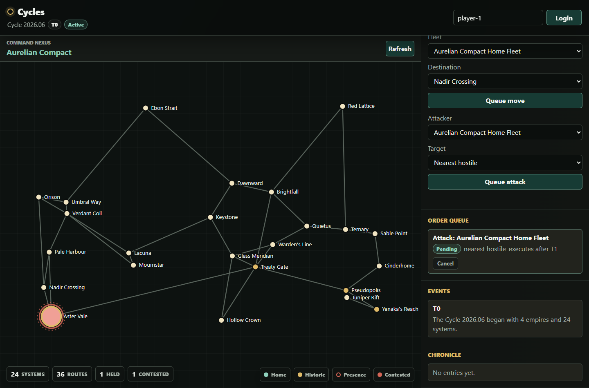
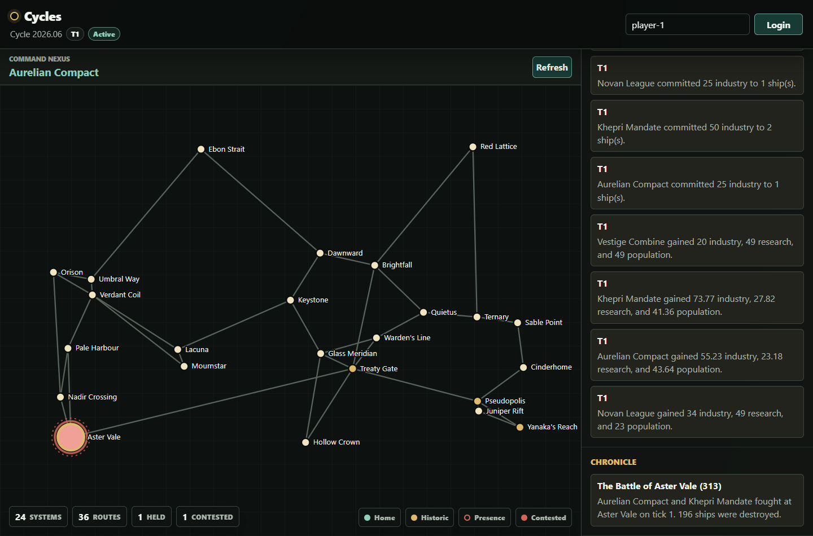
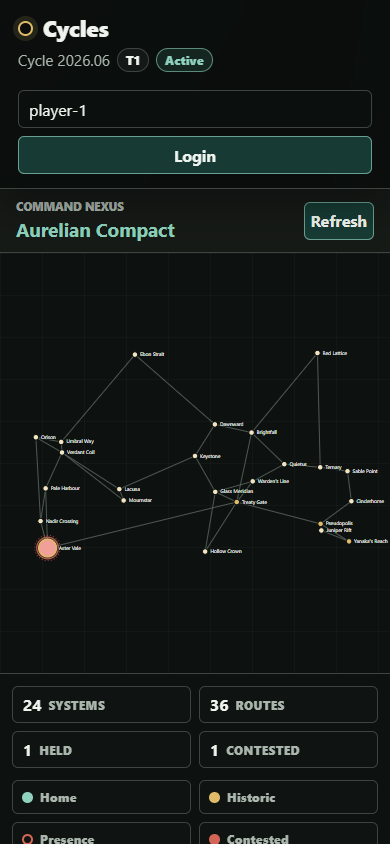

# Project State

Last updated: 2026-06-30

## Current Status

Cycles is currently a local, runnable technical MVP prototype. It proves the core loop described in the technical design document:

1. create a Cycle;
2. generate a galaxy graph;
3. create empires and fleets;
4. submit durable orders;
5. run an authoritative tick;
6. generate resources from influence;
7. move fleets;
8. resolve simple combat;
9. write factual events;
10. preserve important battles as Chronicle entries;
11. snapshot per-tick empire map-control metrics.

This is not yet a production game service. It is a working architecture slice.

## Game Screenshots

These screenshots show a temporary local game state after Aurelian Compact and Khepri Mandate fought over Aster Vale. They are intended as a player-facing reference for what the prototype currently feels like, not as an implementation diagram.

### Command Map

The map shows a Cycle at tick 1, contested influence at Aster Vale, last-tick resource gains, military spending, and the current strategic priority split.


### Issuing Orders

Players can queue fleet movement or attack orders from the dashboard. Orders remain pending until an authoritative tick processes them.



### Events And Chronicle

After the tick resolves, ordinary economy and battle facts appear in the event stream. The Battle of Aster Vale crossed the Chronicle threshold and was preserved as a historical entry.



### Small Screen

The prototype dashboard is still compact, but the command map, Cycle status, and influence readout remain usable on a narrow viewport.



## Repository Shape

| Path | Purpose |
| --- | --- |
| `src/Cycles.Core` | Domain model, seeding, order submission, tick processing, influence, combat, Chronicle scoring, and persistence abstraction. |
| `src/Cycles.Cli` | Manual local runner for seeding, ticking, showing state, and submitting fleet orders. |
| `src/Cycles.Api` | ASP.NET Core Minimal API plus a public website and browser dashboard under `wwwroot`. |
| `src/Cycles.Infrastructure.SqlServer` | SQL Server implementation of the prototype state store. |
| `tests/Cycles.Tests` | xUnit tests for core simulation behaviours. |
| `database/sqldockerdeploykit` | SQL Server container bootstrap, schema, and seed scripts based on the SQLDockerDeployKit pattern. |
| `docs` | Working development intent, state, roadmap, backlog, decision records, and original source documents under `docs/source`. |
| `.github/ISSUE_TEMPLATE` | GitHub issue forms for bug reports, implementation tasks, and design decisions. |

## Implemented Behaviour

### Cycle And Tick

- One active Cycle is seeded by default.
- Cycle duration is set to 90 days.
- Tick length is set to 60 minutes.
- The tick number is the canonical simulation step.
- `TickEngine.RunTick` rejects a tick when another `TickLog` for the same Cycle is already `Running`.
- `TickEngine.RunTick` rejects Cycles that are not `Active`, including `RecoveryRequired` Cycles.
- Tick processing works on a cloned state and commits back only after successful processing.
- Failed ticks are recorded and mark the Cycle as `RecoveryRequired`.
- The CLI has `recovery`, `recovery details`, `recovery clear`, and `recovery retry` commands for inspecting failed ticks, clearing repaired Cycles, and retrying the same tick number.

### Galaxy

- Galaxy generation creates named systems with coordinates.
- Systems have industry, research, population, strategic value, and historical significance fields.
- System links form a connected graph using nearest-neighbour linking.
- Link travel time is currently one or two ticks based on distance.
- Home systems are selected far apart from each other.

### Empires, Resources, And Influence

- Players, empires, empire resources, and empire priorities are represented in the domain model.
- Influence is calculated from active ship presence.
- A home-system minimum presence value gives a founding empire recovery/protection pressure.
- Resource output is split by influence share.
- Resources are stockpiles and are clamped non-negative.
- Last-tick generated and spent resource amounts are stored separately from stockpile totals.
- Strategic priority weights must total 100.
- Military priority spending automatically queues ship construction from available industry.
- Expansion priority increases an empire's derived effective presence for resource and system-detail influence calculations.
- Queued ships cost 25 industry each, complete after 3 ticks, and join the empire's home fleet.
- Generated resource facts are recorded as events.
- Completed ticks record per-empire metric snapshots for `MapControlPercent`, rank, winner flag, total effective presence, and active ship count.

### Orders

- Fleet orders are stored as durable records.
- Supported order types are `MoveFleet`, `Hold`, and `Attack`.
- Orders have submit tick, execute-after tick, processed tick, status, and rejection reason.
- Submission-time validation prevents clearly invalid moves and self-attacks.
- Pending orders can be cancelled before their execution tick by the owning empire.
- Processing-time validation rejects orders that became invalid before execution.

### Movement

- Fleets can move only along linked systems.
- One-tick links move immediately during the processing tick.
- Multi-tick links put fleets in transit with a destination and arrival tick.
- Fleet arrivals generate factual events.

### Combat

- Combat is intentionally simple.
- An attack order engages hostile active fleets in the same system.
- The current resolver uses deterministic pseudo-randomness seeded from Cycle, tick, system, and fleet IDs.
- The deterministic seed contract is documented in `docs/determinism.md`; seeded galaxy generation stabilises layout fields, while combat determinism is based on persisted IDs and tick number.
- Battle records store participants, ships before battle, losses, outcome, and fact JSON.
- Combat events are generated from battle facts.

### Chronicle

- Important battles receive an importance score.
- Score inputs currently include total losses, system strategic value, historical significance, underdog result, and very large loss counts.
- Battles above the current threshold become Chronicle entries.
- Chronicle entries store factual summaries and narrative text separately from raw battle facts.
- Narrative text is currently factual placeholder prose, not AI-generated prose.

### API And Dashboard

- The API exposes current Cycle, last tick summary, empire summary, galaxy, system detail, fleets, fleet detail, order queue, movement orders, attack orders, order cancellation, priorities, recent events, and Chronicle entries.
- The API has development auth: `/auth/login` creates or finds a local player and empire, assigns a `Player` or `Admin` role, and issues an HttpOnly development cookie.
- `/auth/session` restores the current development-auth session for the dashboard.
- Player order and priority mutations derive empire authority from the authenticated player context.
- Admin players can inspect all fleets/orders and can act for an empire for local support/debugging.
- The public website is served from `/`.
- The browser dashboard is served from `/app.html` and uses the development-auth session to render the map, selected-system details, selected-fleet details, resources, priority editing, fleets, order queue, events, Chronicle placeholder/content, and order forms.
- Player read endpoints apply first-pass fog-of-war filtering: the full map structure remains visible, exact presence and local fleet details are only returned for systems where the player has an active fleet, and recent events, last-tick summaries, and Chronicle entries are filtered through the same visibility model.
- Admin development users bypass fog-of-war filtering for local support/debugging.
- Tick execution is intentionally not exposed through the API.

### Persistence

- `IGameStateStore` is the current persistence boundary used by the CLI and API.
- The default state store remains JSON-file-backed for zero-service local development.
- File locking prevents two local writers from mutating the JSON state file at the same time.
- A SQL Server schema/bootstrap image exists under `database/sqldockerdeploykit`.
- `Cycles.Infrastructure.SqlServer` can read, replace, and update `GameState` through SQL Server.
- SQL Server persists per-tick `EmpireMetrics` snapshots for later Cycle-end history work.
- SQL Server schema migrations are plain SQL scripts under `database/migrations`.
- The CLI exposes `db init`, `db migrate`, and `db status` for SQL Server schema setup and inspection.
- Applied SQL migrations are tracked in `dbo.SchemaMigrations`.
- SQL Server updates run inside a transaction protected by `sp_getapplock`.
- Generic SQL Server updates load the whole prototype state, then synchronise mapped rows with targeted deletes and upserts; this remains a bridge, not the final application-service/repository model.
- SQL-backed CLI tick execution now uses a dedicated tick runner that loads a focused tick workspace for the active Cycle: cycle metadata, systems, links, empires, resources, priorities, fleets, due pending orders, due queued ship construction, and running tick logs.
- The SQL tick runner persists tick outcome rows for the active Cycle without loading historical events, battle records, Chronicle entries, future orders, completed construction, old tick logs, or running the generic missing-row deletion pass.

## Verified Checks

Last full restore/build/test verification on 2026-06-24:

```powershell
dotnet restore Cycles.slnx --configfile NuGet.Config
dotnet build Cycles.slnx --no-restore
dotnet test Cycles.slnx --no-build
```

Local test helper verified on 2026-06-30:

```powershell
.\eng\test.ps1 -Filter InfluenceTests
.\eng\test.ps1
```

The automated suite includes determinism tests for seeded galaxy layout fields and combat resolution with stable persisted IDs.
The test helper uses a temporary `BaseOutputPath` so the suite can run even when a local `Cycles.Api` process has the normal build output locked.

Additional smoke checks performed during the MVP build-out:

- CLI seed/tick/show against a temporary state file.
- API health, current Cycle, and galaxy endpoints.
- Browser dashboard desktop and mobile layout checks.
- Browser dashboard move-order submission.
- API development-auth and player/empire authorisation boundary tests.
- CLI `show` and `tick` against SQL Server.
- API `/cycles/current` against SQL Server.
- Opt-in SQL Server integration tests with `CYCLES_SQL_INTEGRATION_CONNECTION_STRING`.

SQL checks rerun after the migration and SQLDockerDeployKit alignment work:

- SQLDockerDeployKit-style SQL Server 2022 image build.
- Disposable `CyclesDb` container startup, migration application, healthcheck, and seed verification.
- CLI `db status` and `show` against the disposable SQL Server container.
- Full test suite with SQL integration enabled through `dotnet test --environment CYCLES_SQL_INTEGRATION_CONNECTION_STRING=...`.

## Known Limitations

These are known gaps, not defects in the current MVP claim:

- SQL Server integration coverage is opt-in and currently covers state-store round trip, order/tick persistence, and duplicate running-tick rollback.
- The SQL Server tick runner still uses an in-memory `GameState` workspace for domain rules instead of a separate `Cycles.Application` tick use case or provider-neutral repository abstraction.
- Development auth is intentionally not production authentication or a multiplayer security boundary.
- Fog-of-war is only a first-pass active-fleet visibility model. There are no sensors, partial estimates, delayed discoveries, or nuanced public/private Chronicle redactions yet.
- No scheduled worker service.
- No production-grade per-Cycle tick locking.
- No real deployment story.
- Per-tick ranking metric snapshots exist, but there is no Cycle-end command, final winner persistence, reset, or continuity.
- Research and population stockpiles do not yet drive unlock or colonisation effects.
- Industry spending only drives the first simple ship construction loop; infrastructure and logistics effects are not implemented.
- No diplomacy, alliances, treaties, or betrayal mechanics.
- No technologies, doctrines, cloaking, detection, or logistics.
- No admirals or persistent named figures.
- No AI narrative generation.
- No historical-system evolution across Cycles.
- No multiplayer security boundary.
- Combat is deliberately primitive and not balanced.
- The dashboard is a prototype, not a full game client.

## Current Development Priority

The next stage should harden the simulation spine before adding feature breadth:

1. make tick execution idempotent and auditable against the focused SQL tick path;
2. add live SQL Server integration verification around migrations and focused repository operations whenever the local container is available;
3. add Cycle-end processing and final ranking persistence;
4. deepen visibility with sensors, estimates, and public/private Chronicle redaction;
5. only then deepen the Chronicle/history systems.

## Definition Of The Next Stable State

The project reaches the next stable state when:

- a fresh checkout can restore, build, test, seed, tick, and run the API from documented commands;
- simulation state can be persisted in a relational store;
- the same due order cannot be processed twice;
- one tick per Cycle is enforced by storage-level locking or an equivalent mechanism;
- core behaviours are covered by deterministic automated tests;
- the dashboard remains able to view state and submit orders against the new persistence layer.
